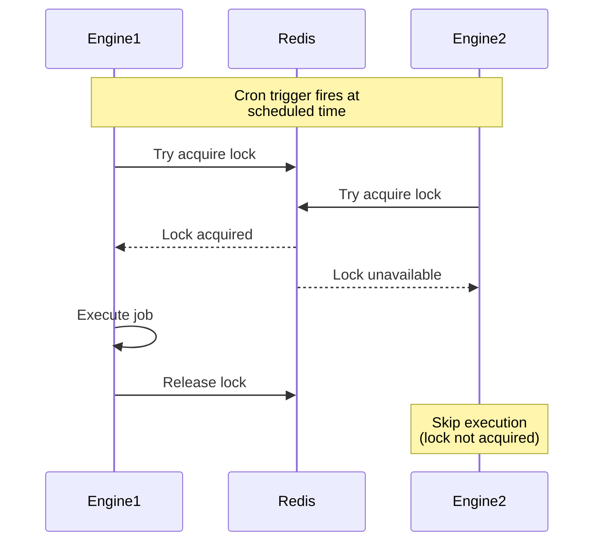

Schedule functions to execute at specific times using cron expressions.

```
modules::cron::CronModule
```

## Sample Configuration

```yaml
- class: modules::cron::CronModule
  config:
    adapter:
      class: modules::cron::RedisCronAdapter
      config:
        redis_url: ${REDIS_URL:redis://localhost:6379}
```

## Configuration

<ResponseField name="adapter" type="Adapter">
  The adapter to use for distributed locking. Defaults to `modules::cron::KvCronAdapter`. Use `RedisCronAdapter` for multi-instance deployments.
</ResponseField>

## Adapters

### modules::cron::KvCronAdapter

Built-in adapter using process-local locks. Suitable for single-instance deployments. Cron jobs may run on every engine instance when using multiple instances.

```yaml
class: modules::cron::KvCronAdapter
```

### modules::cron::RedisCronAdapter

Uses Redis for distributed locking to prevent duplicate job execution across multiple engine instances.

```yaml
class: modules::cron::RedisCronAdapter
config:
  redis_url: ${REDIS_URL:redis://localhost:6379}
```

#### Configuration

<ResponseField name="redis_url" type="string">
  The URL of the Redis instance to use for distributed locking.
</ResponseField>

## Trigger Type

This Module adds a new Trigger Type: `cron`.

<Expandable title="Trigger Config">
  <ResponseField name="cron" type="string" required>
    Standard cron expression defining the schedule. Supports the following format:

    ```
    * * * * *
    │ │ │ │ │
    │ │ │ │ └─── Day of week (0-7, where 0 and 7 are Sunday)
    │ │ │ └───── Month (1-12)
    │ │ └─────── Day of month (1-31)
    │ └───────── Hour (0-23)
    └─────────── Minute (0-59)
    ```

  </ResponseField>
  <ResponseField name="condition_function_id" type="string">
    Function ID for conditional execution. The engine invokes it with the cron event; if it returns `false`, the handler is skipped.
  </ResponseField>
</Expandable>

### Sample Code

```typescript
const fn = iii.registerFunction(
  { id: 'jobs.cleanupOldData' },
  async () => {
    console.log('Running scheduled cleanup...')
    return {}
  },
)

iii.registerTrigger({
  type: 'cron',
  function_id: fn.id,
  config: { cron: '0 2 * * *' },
})
```

## Common Cron Expressions

| Expression       | Description                                    |
| ---------------- | ---------------------------------------------- |
| `* * * * *`      | Every minute                                   |
| `0 * * * *`      | Every hour                                     |
| `0 0 * * *`      | Every day at midnight                          |
| `0 0 * * 0`      | Every Sunday at midnight                       |
| `0 2 * * *`      | Every day at 2 AM                              |
| `*/5 * * * *`    | Every 5 minutes                                |
| `0 9-17 * * 1-5` | Every hour from 9 AM to 5 PM, Monday to Friday |

## Distributed Execution

When running multiple iii Engine instances, the Cron Module uses distributed locking to ensure jobs execute only once:


