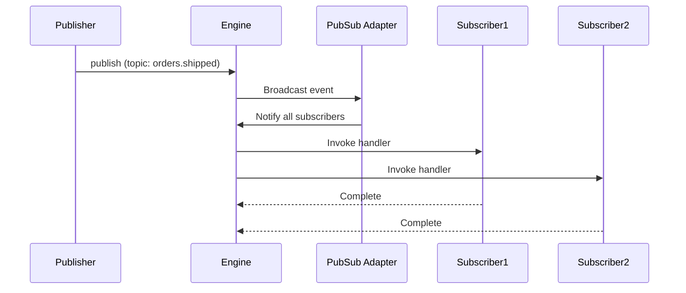

Topic-based publish/subscribe messaging for broadcasting events to multiple subscribers in real time.

```
modules::pubsub::PubSubModule
```

## Sample Configuration

```yaml
- class: modules::pubsub::PubSubModule
  config:
    adapter:
      class: modules::pubsub::LocalAdapter
```

## Configuration

<ResponseField name="adapter" type="Adapter">
  The adapter to use for pub/sub distribution. Defaults to `modules::pubsub::LocalAdapter` (in-memory) when not specified.
</ResponseField>

## Adapters

### modules::pubsub::LocalAdapter

In-memory pub/sub using broadcast channels. Messages are delivered only to subscribers running in the same engine process. No external dependencies required.

```yaml
class: modules::pubsub::LocalAdapter
```

### modules::pubsub::RedisAdapter

Uses Redis Pub/Sub as the backend. Enables event delivery across multiple engine instances.

```yaml
class: modules::pubsub::RedisAdapter
config:
  redis_url: ${REDIS_URL:redis://localhost:6379}
```

#### Configuration

<ResponseField name="redis_url" type="string">
  The URL of the Redis instance to use.
</ResponseField>

## Functions

<ResponseField name="publish" type="function">
  Publish an event to a topic. All functions subscribed to that topic will be invoked with the payload.

  <AccordionGroup>
    <Accordion iconName="settings" title="Parameters">
      <ResponseField name="topic" type="string" required>
        The topic to publish to. Must not be empty.
      </ResponseField>
      <ResponseField name="data" type="any" required>
        The event payload to broadcast. Can be any JSON-serializable value.
      </ResponseField>
    </Accordion>
    <Accordion title="Returns">
      <ResponseField name="result" type="null">
        Returns `null` on success.
      </ResponseField>
    </Accordion>
  </AccordionGroup>
</ResponseField>

## Trigger Type

This module adds a new Trigger Type: `subscribe`.

<Expandable title="Trigger Config">
  <ResponseField name="topic" type="string" required>
    The topic to subscribe to. The function will be invoked whenever an event is published to this topic.
  </ResponseField>
</Expandable>

### Sample Code

```typescript
const fn = iii.registerFunction(
  { id: 'notifications.onOrderShipped' },
  async (data) => {
    console.log('Order shipped:', data)
    return {}
  },
)

iii.registerTrigger({
  type: 'subscribe',
  function_id: fn.id,
  config: { topic: 'orders.shipped' },
})

await iii.call('publish', {
  topic: 'orders.shipped',
  data: { orderId: 'abc-123', address: '123 Main St' },
})
```

## PubSub vs Queue

| Feature | PubSub | Queue |
|---|---|---|
| Delivery | Broadcast to all subscribers | Single consumer per message |
| Persistence | No (fire-and-forget) | Yes (with retries and DLQ) |
| Ordering | Not guaranteed | FIFO within topic |
| Best for | Real-time notifications, fanout | Reliable background processing |

## PubSub Flow


