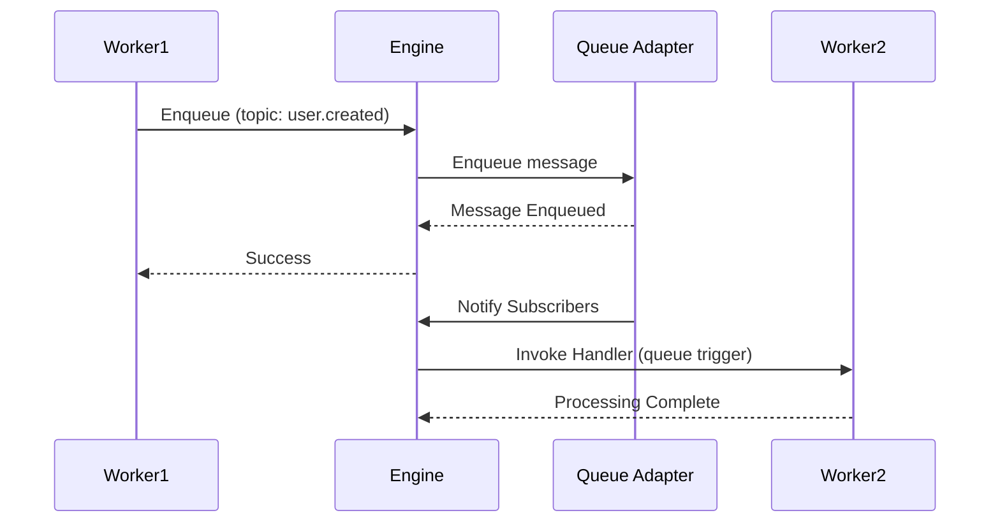

A queue module for event-driven messaging patterns.

```
modules::queue::QueueModule
```

## Sample Configuration

```yaml
- class: modules::queue::QueueModule
  config:
    adapter:
      class: modules::queue::BuiltinQueueAdapter
```

## Configuration

<ResponseField name="adapter" type="Adapter">
  The adapter to use for queue persistence and distribution. Defaults to `modules::queue::BuiltinQueueAdapter` when not specified.
</ResponseField>

## Functions

<ResponseField name="enqueue" type="function">
  Enqueue a message to a specific topic.

  <AccordionGroup>
    <Accordion iconName="settings" title="Parameters">
      <ResponseField name="topic" type="string" required>
        The topic to enqueue the message to. Must not be empty.
      </ResponseField>
      <ResponseField name="data" type="any" required>
        The message payload to enqueue.
      </ResponseField>
    </Accordion>
    <Accordion title="Returns">
      <ResponseField name="result" type="null">
        Returns `null` on success.
      </ResponseField>
    </Accordion>
  </AccordionGroup>
</ResponseField>

## Trigger Type

This Module adds a new Trigger Type: `queue`.

<Expandable title="Trigger Config">
  <ResponseField name="topic" type="string" required>
    The topic to subscribe to. The function will be invoked whenever a message is enqueued to this topic.
  </ResponseField>
  <ResponseField name="_condition_path" type="string">
    Function ID for conditional execution. The engine invokes it with the message payload; if it returns `false`, the handler is skipped.
  </ResponseField>
</Expandable>

### Sample Code

```typescript
const fn = iii.registerFunction(
  { id: 'events.onUserCreated' },
  async (data) => {
    console.log('User created:', data)
    return {}
  },
)

iii.registerTrigger({
  type: 'queue',
  function_id: fn.id,
  config: { topic: 'user.created' },
})

await iii.call('enqueue', {
  topic: 'user.created',
  data: { id: '123', email: 'user@example.com' },
})
```

## Queue Flow


