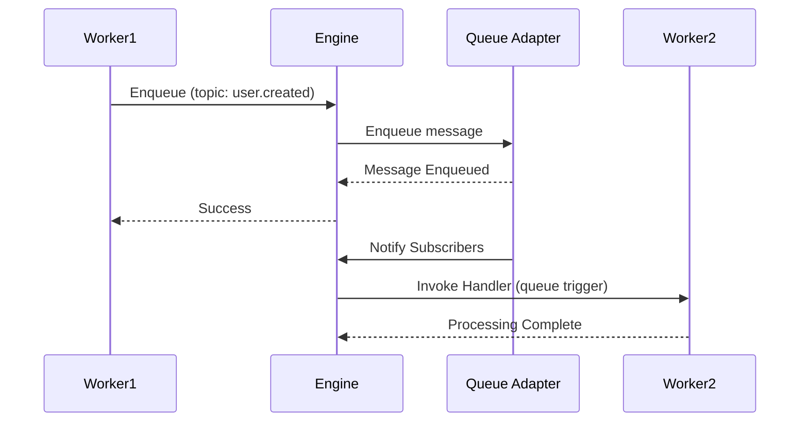

A queue module for event-driven messaging patterns.

```
modules::queue::QueueModule
```

## Sample Configuration

```yaml
- class: modules::queue::QueueModule
  config:
    adapter:
      class: modules::queue::BuiltinQueueAdapter
```

## Configuration

<ResponseField name="adapter" type="Adapter">
  The adapter to use for queue persistence and distribution. Defaults to `modules::queue::BuiltinQueueAdapter` when not specified.
</ResponseField>

## Adapters

### modules::queue::BuiltinQueueAdapter

Built-in in-process queue. No external dependencies. Suitable for single-instance deployments only — messages are not shared across engine instances.

```yaml
class: modules::queue::BuiltinQueueAdapter
```

### modules::queue::RedisAdapter

Uses Redis Streams as the queue backend. Enables message sharing across multiple engine instances.

```yaml
class: modules::queue::RedisAdapter
config:
  redis_url: ${REDIS_URL:redis://localhost:6379}
```

<ResponseField name="redis_url" type="string">
  The URL of the Redis instance to connect to.
</ResponseField>

### modules::queue::RabbitMQAdapter

Uses RabbitMQ as the queue backend. Supports retries, dead-letter queues, and durable message delivery across multiple engine instances.

```yaml
class: modules::queue::RabbitMQAdapter
config:
  amqp_url: ${RABBITMQ_URL:amqp://localhost:5672}
  max_attempts: 3
  prefetch_count: 10
```

<ResponseField name="amqp_url" type="string">
  The AMQP URL of the RabbitMQ instance to connect to.
</ResponseField>

<ResponseField name="max_attempts" type="number">
  Maximum number of delivery attempts before sending to the dead-letter queue. Defaults to `3`.
</ResponseField>

<ResponseField name="prefetch_count" type="number">
  Number of messages to prefetch per consumer. Defaults to `10`.
</ResponseField>

## Functions

<ResponseField name="enqueue" type="function">
  Enqueue a message to a specific topic.

  <AccordionGroup>
    <Accordion iconName="settings" title="Parameters">
      <ResponseField name="topic" type="string" required>
        The topic to enqueue the message to. Must not be empty.
      </ResponseField>
      <ResponseField name="data" type="any" required>
        The message payload to enqueue.
      </ResponseField>
    </Accordion>
    <Accordion title="Returns">
      <ResponseField name="result" type="null">
        Returns `null` on success.
      </ResponseField>
    </Accordion>
  </AccordionGroup>
</ResponseField>

## Trigger Type

This Module adds a new Trigger Type: `queue`.

<Expandable title="Trigger Config">
  <ResponseField name="topic" type="string" required>
    The topic to subscribe to. The function will be invoked whenever a message is enqueued to this topic.
  </ResponseField>
  <ResponseField name="_condition_path" type="string">
    Function ID for conditional execution. The engine invokes it with the message payload; if it returns `false`, the handler function is not called.
  </ResponseField>
</Expandable>

### Sample Code

```typescript
const fn = iii.registerFunction(
  { id: 'events.onUserCreated' },
  async (data) => {
    console.log('User created:', data)
    return {}
  },
)

iii.registerTrigger({
  type: 'queue',
  function_id: fn.id,
  config: { topic: 'user.created' },
})

await iii.trigger('enqueue', {
  topic: 'user.created',
  data: { id: '123', email: 'user@example.com' },
})
```

## Queue Flow


