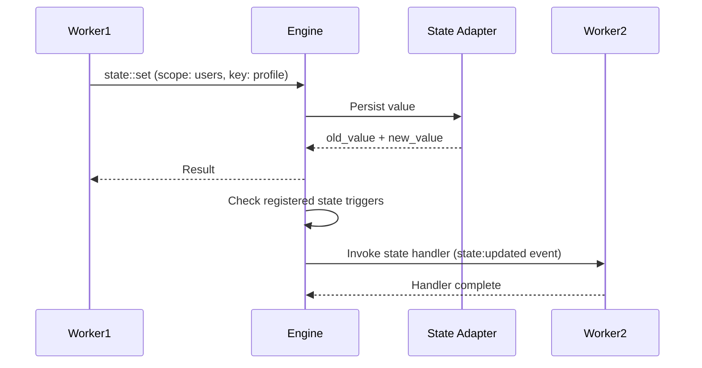

Distributed key-value state storage with scope-based organization and reactive triggers that fire on any state change.

```
modules::state::StateModule
```

## Sample Configuration

```yaml
- class: modules::state::StateModule
  config:
    adapter:
      class: modules::state::adapters::KvStore
      config:
        store_method: file_based
        file_path: ./data/state_store
        save_interval_ms: 5000
```

## Configuration

<ResponseField name="adapter" type="Adapter">
  The adapter to use for state persistence and distribution. Defaults to `modules::state::adapters::KvStore` when not specified.
</ResponseField>

## Adapters

### modules::state::adapters::KvStore

Built-in key-value store. Supports both in-memory and file-based persistence.

```yaml
class: modules::state::adapters::KvStore
config:
  store_method: file_based
  file_path: ./data/state_store
  save_interval_ms: 5000
```

#### Configuration

<ResponseField name="store_method" type="string">
  Storage method. Options: `in_memory` (lost on restart) or `file_based` (persisted to disk).
</ResponseField>

<ResponseField name="file_path" type="string">
  Directory path for file-based storage. Each scope is stored as a separate file.
</ResponseField>

<ResponseField name="save_interval_ms" type="number">
  Interval in milliseconds between automatic disk saves. Defaults to `5000`.
</ResponseField>

### modules::state::adapters::RedisAdapter

Uses Redis as the state backend.

```yaml
class: modules::state::adapters::RedisAdapter
config:
  redis_url: ${REDIS_URL:redis://localhost:6379}
```

#### Configuration

<ResponseField name="redis_url" type="string">
  The URL of the Redis instance to use.
</ResponseField>

### modules::state::adapters::Bridge

Forwards state operations to a remote III Engine instance via the Bridge Client.

```yaml
class: modules::state::adapters::Bridge
```

## Functions

<ResponseField name="state::set" type="function">
  Set a value in state. Fires a `state:created` trigger if the key did not exist, or `state:updated` if it did.

  <AccordionGroup>
    <Accordion iconName="settings" title="Parameters">
      <ResponseField name="scope" type="string" required>
        The scope (namespace) to organize state within.
      </ResponseField>
      <ResponseField name="key" type="string" required>
        The key to store the value under.
      </ResponseField>
      <ResponseField name="data" type="any" required>
        The value to store. Can be any JSON-serializable value.
      </ResponseField>
    </Accordion>
    <Accordion title="Returns">
      <ResponseField name="result" type="object">
        An object containing `old_value` (the previous value or `null`) and `new_value` (the stored value).
      </ResponseField>
    </Accordion>
  </AccordionGroup>
</ResponseField>

<ResponseField name="state::get" type="function">
  Get a value from state.

  <AccordionGroup>
    <Accordion iconName="settings" title="Parameters">
      <ResponseField name="scope" type="string" required>
        The scope to read from.
      </ResponseField>
      <ResponseField name="key" type="string" required>
        The key to retrieve.
      </ResponseField>
    </Accordion>
    <Accordion title="Returns">
      <ResponseField name="value" type="any">
        The stored value, or `null` if the key does not exist.
      </ResponseField>
    </Accordion>
  </AccordionGroup>
</ResponseField>

<ResponseField name="state::delete" type="function">
  Delete a value from state. Fires a `state:deleted` trigger.

  <AccordionGroup>
    <Accordion iconName="settings" title="Parameters">
      <ResponseField name="scope" type="string" required>
        The scope to delete from.
      </ResponseField>
      <ResponseField name="key" type="string" required>
        The key to delete.
      </ResponseField>
    </Accordion>
    <Accordion title="Returns">
      <ResponseField name="value" type="any">
        The deleted value, or `null` if the key did not exist.
      </ResponseField>
    </Accordion>
  </AccordionGroup>
</ResponseField>

<ResponseField name="state::update" type="function">
  Atomically update a value using one or more operations. Fires `state:created` or `state:updated` depending on whether the key existed.

  <AccordionGroup>
    <Accordion iconName="settings" title="Parameters">
      <ResponseField name="scope" type="string" required>
        The scope to update within.
      </ResponseField>
      <ResponseField name="key" type="string" required>
        The key to update.
      </ResponseField>
      <ResponseField name="ops" type="UpdateOp[]" required>
        Array of update operations. Supported operations: `set`, `merge`, `increment`, `decrement`, `remove`.
      </ResponseField>
    </Accordion>
    <Accordion title="Returns">
      <ResponseField name="result" type="object">
        An object containing `old_value` and `new_value` after applying all operations.
      </ResponseField>
    </Accordion>
  </AccordionGroup>
</ResponseField>

<ResponseField name="state::list" type="function">
  List all key-value pairs within a scope.

  <AccordionGroup>
    <Accordion iconName="settings" title="Parameters">
      <ResponseField name="scope" type="string" required>
        The scope to list entries from.
      </ResponseField>
    </Accordion>
    <Accordion title="Returns">
      <ResponseField name="values" type="any[]">
        An array of all values within the scope.
      </ResponseField>
    </Accordion>
  </AccordionGroup>
</ResponseField>

<ResponseField name="state::list_groups" type="function">
  List all scopes that contain state data.

  <AccordionGroup>
    <Accordion title="Returns">
      <ResponseField name="groups" type="string[]">
        A sorted, deduplicated array of scope names.
      </ResponseField>
    </Accordion>
  </AccordionGroup>
</ResponseField>

## Trigger Type

This module adds a new Trigger Type: `state`.

When a state value is created, updated, or deleted, all registered `state` triggers are evaluated and fired if they match.

<Expandable title="Trigger Config">
  <ResponseField name="scope" type="string">
    Only fire for state changes within this scope. When omitted, fires for all scopes.
  </ResponseField>
  <ResponseField name="key" type="string">
    Only fire for state changes to this specific key. When omitted, fires for all keys.
  </ResponseField>
  <ResponseField name="condition_function_id" type="string">
    Function ID for conditional execution. The engine invokes it with the state event; if it returns `false`, the handler function is not called.
  </ResponseField>
</Expandable>

### State Event Payload

When the trigger fires, the handler receives a state event object:

<ResponseField name="type" type="string">
  Always `"state"`.
</ResponseField>

<ResponseField name="event_type" type="string">
  The kind of change: `"state:created"`, `"state:updated"`, or `"state:deleted"`.
</ResponseField>

<ResponseField name="scope" type="string">
  The scope where the change occurred.
</ResponseField>

<ResponseField name="key" type="string">
  The key that changed.
</ResponseField>

<ResponseField name="old_value" type="any">
  The previous value before the change, or `null` for newly created keys.
</ResponseField>

<ResponseField name="new_value" type="any">
  The new value after the change. `null` for deleted keys.
</ResponseField>

### Sample Code

```typescript
const fn = iii.registerFunction(
  { id: 'state.onUserUpdated' },
  async (event) => {
    console.log('State changed:', event.event_type, event.key)
    console.log('Previous:', event.old_value)
    console.log('Current:', event.new_value)
    return {}
  },
)

iii.registerTrigger({
  type: 'state',
  function_id: fn.id,
  config: { scope: 'users', key: 'profile' },
})
```

### Usage Example: User Profile with Reactive Sync

Store user profiles in state and react when they change:

```typescript
await iii.call('state::set', {
  scope: 'users',
  key: 'user-123',
  data: { name: 'Alice', email: 'alice@example.com', preferences: { theme: 'dark' } },
})

const profile = await iii.call('state::get', { scope: 'users', key: 'user-123' })

await iii.call('state::set', {
  scope: 'users',
  key: 'user-123',
  data: { name: 'Alice', email: 'alice@example.com', preferences: { theme: 'light' } },
})

const allUsers = await iii.call('state::list', { scope: 'users' })
const scopes = await iii.call('state::list_groups', {})
```

### Usage Example: Conditional Trigger

Only process profile updates when the email field changed:

```typescript
const conditionFn = iii.registerFunction(
  { id: 'conditions::emailChanged' },
  async (event) =>
    event.event_type === 'state:updated' &&
    event.old_value?.email !== event.new_value?.email,
)

const fn = iii.registerFunction({ id: 'state::onEmailChange' }, async (event) => {
  await sendVerificationEmail(event.new_value.email)
  return {}
})

iii.registerTrigger({
  type: 'state',
  function_id: fn.id,
  config: {
    scope: 'users',
    key: 'profile',
    condition_function_id: conditionFn.id,
  },
})
```

## State Flow


