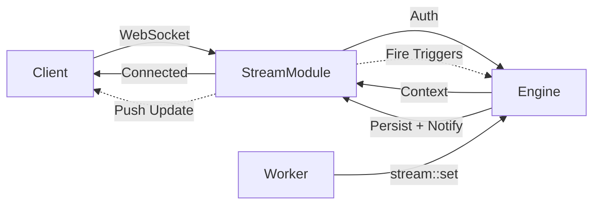

Durable streams for real-time data subscriptions.

```
modules::stream::StreamModule
```

## Architecture



## Data Flow

When a worker triggers `stream::set`, the engine:

1. Persists the data via the configured adapter (Redis or KvStore)
2. Publishes a notification to all WebSocket clients subscribed to that stream and group
3. Evaluates registered `stream` triggers and fires matching handlers

A single `stream::set` handles persistence, real-time delivery, and reactive logic in one operation.

## Groups

Streams organize data hierarchically: `stream_name` > `group_id` > `item_id`.

- **stream_name** identifies the top-level stream (e.g. `chat`, `presence`, `dashboard`)
- **group_id** partitions data within a stream (e.g. `room-1`, `team-alpha`)
- **item_id** uniquely identifies a record within a group (e.g. `user-123`, `msg-456`)

Clients subscribe at the group level by connecting to `ws://host:port/stream/{stream_name}/{group_id}/`. They receive all item-level changes within that group.

## Sample Configuration

```yaml
- class: modules::stream::StreamModule
  config:
    port: ${STREAM_PORT:3112}
    host: 0.0.0.0
    adapter:
      class: modules::stream::adapters::RedisAdapter
      config:
        redis_url: ${REDIS_URL:redis://localhost:6379}
```

## Configuration

<ResponseField name="port" type="number">
  The port to listen on. Defaults to `3112`.
</ResponseField>

<ResponseField name="host" type="string">
  The host to listen on. Defaults to `0.0.0.0`.
</ResponseField>

<ResponseField name="auth_function" type="string">
  The authentication function to use. It's a path to a function that will be used to authenticate the client. You can
  register the function using the iii SDK and then use the path to the function here.
</ResponseField>

<ResponseField name="adapter" type="Adapter">
  The adapter to use. It's the adapter that will be used to store the streams. You can register the adapter using the
  iii SDK and then use the path to the adapter here.
</ResponseField>

## Adapters

### modules::stream::adapters::RedisAdapter

Uses Redis as the backend for the streams. Stores stream data in Redis and leverages Redis Pub/Sub for real-time event delivery.

```yaml
class: modules::stream::adapters::RedisAdapter
config:
  redis_url: ${REDIS_URL:redis://localhost:6379}
```

#### Configuration

<ResponseField name="redis_url" type="string">
  The URL of the Redis instance to use.
</ResponseField>

### modules::stream::adapters::KvStore

Built-in key-value store. Supports in-memory or file-based persistence. No external dependencies required.

```yaml
class: modules::stream::adapters::KvStore
config:
  store_method: file_based
  file_path: ./data/streams_store.db
```

#### Configuration

<ResponseField name="store_method" type="string">
  Storage method. Options: `in_memory` (lost on restart) or `file_based` (persisted to disk).
</ResponseField>

<ResponseField name="file_path" type="string">
  Directory path for file-based storage. Each stream is stored as a separate file.
</ResponseField>
## Functions

<ResponseField name="stream::set" type="function">
  Sets a value in the stream.

  <AccordionGroup>
    <Accordion iconName="settings" title="Parameters">
      <ResponseField name="stream_name" type="string" required>
        The ID of the stream to set the value in.
      </ResponseField>
      <ResponseField name="group_id" type="string" required>
        The group ID of the stream to set the value in.
      </ResponseField>
      <ResponseField name="item_id" type="string" required>
        The item ID of the stream to set the value in.
      </ResponseField>
      <ResponseField name="data" type="any" required>
        The value to set in the stream.
      </ResponseField>
    </Accordion>
    <Accordion title="Returns">
      <ResponseField name="value" type="any" required>
        The value set in the stream.
      </ResponseField>
    </Accordion>
  </AccordionGroup>
</ResponseField>

<ResponseField name="stream::get" type="function">
  Gets a value from the stream.

{' '}

<AccordionGroup>
  <Accordion title="Parameters">
    <ResponseField name="stream_name" type="string" required>
      The ID of the stream to retrieve the value from.
    </ResponseField>
    <ResponseField name="group_id" type="string" required>
      The group ID in the stream to retrieve the value from.
    </ResponseField>
    <ResponseField name="item_id" type="string" required>
      The item ID in the stream to retrieve.
    </ResponseField>
  </Accordion>
  <Accordion title="Returns">
    <ResponseField name="value" type="any" required>
      The value retrieved from the stream.
    </ResponseField>
  </Accordion>
</AccordionGroup>

</ResponseField>

<ResponseField name="stream::delete" type="function">
  Deletes a value from the stream.

  <AccordionGroup>
    <Accordion iconName="settings" title="Parameters">
      <ResponseField name="stream_name" type="string" required>
        The ID of the stream to delete the value from.
      </ResponseField>
      <ResponseField name="group_id" type="string" required>
        The group ID in the stream to delete the value from.
      </ResponseField>
      <ResponseField name="item_id" type="string" required>
        The item ID in the stream to delete.
      </ResponseField>
    </Accordion>
    <Accordion title="Returns">
      <ResponseField name="value" type="any" required>
        The value deleted from the stream.
      </ResponseField>
    </Accordion>
  </AccordionGroup>
</ResponseField>

<ResponseField name="stream::list" type="function">
  Retrieves a group from the stream. This function will return all the items in the group.
  <AccordionGroup>
    <Accordion iconName="settings" title="Parameters">
      <ResponseField name="stream_name" type="string" required>
        The ID of the stream to retrieve the group from.
      </ResponseField>
      <ResponseField name="group_id" type="string" required>
        The group ID in the stream to retrieve the group from.
      </ResponseField>
    </Accordion>
    <Accordion title="Returns">
      <ResponseField name="group" type="any[]" required>
        The group retrieved from the stream. It's an array of items in the group.
      </ResponseField>
    </Accordion>
  </AccordionGroup>
</ResponseField>

<ResponseField name="stream::list_groups" type="function">
  List all groups in a stream.

  <AccordionGroup>
    <Accordion iconName="settings" title="Parameters">
      <ResponseField name="stream_name" type="string" required>
        The ID of the stream to list groups from.
      </ResponseField>
    </Accordion>
    <Accordion title="Returns">
      <ResponseField name="groups" type="string[]" required>
        An array of group IDs in the stream.
      </ResponseField>
    </Accordion>
  </AccordionGroup>
</ResponseField>

<ResponseField name="stream::list_all" type="function">
  List all items across all groups in a stream.

  <AccordionGroup>
    <Accordion iconName="settings" title="Parameters">
      <ResponseField name="stream_name" type="string" required>
        The ID of the stream to list all items from.
      </ResponseField>
    </Accordion>
    <Accordion title="Returns">
      <ResponseField name="items" type="any[]" required>
        An array of all items across all groups in the stream.
      </ResponseField>
    </Accordion>
  </AccordionGroup>
</ResponseField>

<ResponseField name="stream::send" type="function">
  Send a message to all subscribers of a stream group.

  <AccordionGroup>
    <Accordion iconName="settings" title="Parameters">
      <ResponseField name="stream_name" type="string" required>
        The ID of the stream to send the message to.
      </ResponseField>
      <ResponseField name="group_id" type="string" required>
        The group ID in the stream to send the message to.
      </ResponseField>
      <ResponseField name="data" type="any" required>
        The message payload to send.
      </ResponseField>
    </Accordion>
    <Accordion title="Returns">
      <ResponseField name="result" type="null">
        Returns `null` on success.
      </ResponseField>
    </Accordion>
  </AccordionGroup>
</ResponseField>

<ResponseField name="stream::update" type="function">
  Update an existing item in the stream using patch operations.

  <AccordionGroup>
    <Accordion iconName="settings" title="Parameters">
      <ResponseField name="stream_name" type="string" required>
        The ID of the stream containing the item to update.
      </ResponseField>
      <ResponseField name="group_id" type="string" required>
        The group ID in the stream containing the item to update.
      </ResponseField>
      <ResponseField name="item_id" type="string" required>
        The item ID in the stream to update.
      </ResponseField>
      <ResponseField name="data" type="any" required>
        The updated data to apply to the item.
      </ResponseField>
    </Accordion>
    <Accordion title="Returns">
      <ResponseField name="value" type="any" required>
        The updated value in the stream.
      </ResponseField>
    </Accordion>
  </AccordionGroup>
</ResponseField>

## Authentication

It's possible to implement a function to handle authentication.

1. Define a function to handle the authentication. It received one single argument with the request data.

<Expandable title="StreamAuthInput">
  <ResponseField name="headers" type="Record&lt;string, string&gt;" required>
    The HTTP headers sent with the request.
  </ResponseField>
  <ResponseField name="path" type="string" required>
    The request path.
  </ResponseField>
  <ResponseField name="query_params" type="Record&lt;string, string[]&gt;" required>
    Query parameters in the request, as a map from key to array of string values.
  </ResponseField>
  <ResponseField name="addr" type="string" required>
    The remote address (IP) of the request.
  </ResponseField>
</Expandable>

<Tabs groupId="language" persist items={["Node / TypeScript", "Python", "Rust"]}>
<Tab value="Node / TypeScript">
```typescript
iii.registerFunction({ id: 'onAuth' }, (input) => ({
  context: { name: 'John Doe' },
}))
```
</Tab>
<Tab value="Python">
```python
async def on_auth(input):
    return {'context': {'name': 'John Doe'}}

iii.register_function('onAuth', on_auth)
```
</Tab>
<Tab value="Rust">
```rust
iii.register_function("onAuth", |_input| async move {
    Ok(json!({ "context": { "name": "John Doe" } }))
})?;
```
</Tab>
</Tabs>

2. Make sure you add the function to the configuration file.

```yaml
- class: modules::stream::StreamModule
  config:
    auth_function: onAuth
```

3. Now whenever someone opens a websocket connection, the function `onAuth` will be called with the request data.

## Trigger Types

This module adds three trigger types: `stream` (item changes), `stream:join` (WebSocket connect), and `stream:leave` (WebSocket disconnect).
Join and leave triggers receive the same payload shape when invoked.

<ResponseField name="subscription_id" type="string" required>
  The subscription ID, mostly used for uniqueness or logging purposes.
</ResponseField>
<ResponseField name="stream_name" type="string" required>
  The stream name of the subscription
</ResponseField>
<ResponseField name="group_id" type="string" required>
  The Group ID of the subscription.
</ResponseField>
<ResponseField name="id" type="string" required>
  The item ID of the subscription.
</ResponseField>
<ResponseField name="context" type="object">
  The context generated by the authentication layer.
</ResponseField>

<ResponseField name="condition_function_id" type="string">
  Function ID for conditional execution. Only applies to the `stream` trigger type (not `stream:join` or `stream:leave`). The engine invokes it with the subscription payload; if it returns `false`, the handler function is not called.
</ResponseField>

### Sample Code

<Tabs groupId="language" persist items={["Node / TypeScript", "Python", "Rust"]}>
<Tab value="Node / TypeScript">
```typescript
const fn = iii.registerFunction({ id: 'onJoin' }, (input) => {
  console.log('Joined stream', input)
  return {}
})

iii.registerTrigger({
  type: 'stream:join',
  function_id: fn.id,
  config: {},
})
```
</Tab>
<Tab value="Python">
```python
async def on_join(input):
    print('Joined stream', input)
    return {}

iii.register_function('onJoin', on_join)
iii.register_trigger(type='stream:join', function_id='onJoin', config={})
```
</Tab>
<Tab value="Rust">
```rust
iii.register_function("onJoin", |input| async move {
    println!("Joined stream: {:?}", input);
    Ok(json!({}))
})?;

iii.register_trigger("stream:join", "onJoin", json!({}))?;
```
</Tab>
</Tabs>

### Usage Example: Real-Time Presence

Streams organize data by `stream_name`, `group_id`, and `item_id`. Use for live presence, collaborative docs, or dashboards:

<Tabs groupId="language" persist items={["Node / TypeScript", "Python", "Rust"]}>
<Tab value="Node / TypeScript">
```typescript
const iii = init('ws://localhost:49134')

await iii.trigger('stream::set', {
  stream_name: 'presence',
  group_id: 'room-1',
  item_id: 'user-123',
  data: { name: 'Alice', online: true, lastSeen: new Date().toISOString() },
})

const user = await iii.trigger('stream::get', {
  stream_name: 'presence',
  group_id: 'room-1',
  item_id: 'user-123',
})

const roomMembers = await iii.trigger('stream::list', {
  stream_name: 'presence',
  group_id: 'room-1',
})

await iii.trigger('stream::delete', {
  stream_name: 'presence',
  group_id: 'room-1',
  item_id: 'user-123',
})
```
</Tab>
<Tab value="Python">
```python
from iii import III

iii = III('ws://localhost:49134')
await iii.connect()

await iii.trigger('stream::set', {
    'stream_name': 'presence',
    'group_id': 'room-1',
    'item_id': 'user-123',
    'data': {'name': 'Alice', 'online': True, 'lastSeen': '2026-01-01T00:00:00Z'},
})

user = await iii.trigger('stream::get', {
    'stream_name': 'presence',
    'group_id': 'room-1',
    'item_id': 'user-123',
})

room_members = await iii.trigger('stream::list', {
    'stream_name': 'presence',
    'group_id': 'room-1',
})

await iii.trigger('stream::delete', {
    'stream_name': 'presence',
    'group_id': 'room-1',
    'item_id': 'user-123',
})
```
</Tab>
<Tab value="Rust">
```rust
use iii_sdk::III;
use serde_json::json;

let iii = III::new("ws://localhost:49134");
iii.connect().await?;

iii.trigger("stream::set", json!({
    "stream_name": "presence",
    "group_id": "room-1",
    "item_id": "user-123",
    "data": { "name": "Alice", "online": true }
})).await?;

let user = iii.trigger("stream::get", json!({
    "stream_name": "presence",
    "group_id": "room-1",
    "item_id": "user-123"
})).await?;

let room_members = iii.trigger("stream::list", json!({
    "stream_name": "presence",
    "group_id": "room-1"
})).await?;

iii.trigger("stream::delete", json!({
    "stream_name": "presence",
    "group_id": "room-1",
    "item_id": "user-123"
})).await?;
```
</Tab>
</Tabs>

Clients connect via WebSocket to `ws://host:3112/stream/presence/room-1/` and receive real-time updates when items change.

### Usage Example: Join with Auth Context

Configure the stream module with an auth function:

```yaml
- class: modules::stream::StreamModule
  config:
    port: 3112
    host: 0.0.0.0
    auth_function: stream::auth
    adapter:
      class: modules::stream::adapters::KvStore
      config:
        store_method: file_based
        file_path: ./data/stream_store
```

Register the auth function. Clients may send the token via `Authorization: Bearer <token>` (Node.js) or `Sec-WebSocket-Protocol: Authorization,<token>` (browser stream-client):

<Tabs groupId="language" persist items={["Node / TypeScript", "Python", "Rust"]}>
<Tab value="Node / TypeScript">
```typescript
iii.registerFunction({ id: 'stream::auth' }, (input) => {
  const auth = input.headers?.['authorization']?.replace(/^Bearer\s+/i, '')
  const proto = input.headers?.['sec-websocket-protocol']
  const token = auth ?? (proto?.startsWith('Authorization,') ? proto.slice(13) : null)
  return token ? { context: { userId: 'user-from-token' } } : { context: null }
})
```
</Tab>
<Tab value="Python">
```python
async def stream_auth(input):
    auth = input.get('headers', {}).get('authorization', '')
    token = auth.replace('Bearer ', '', 1) if auth.startswith('Bearer ') else None
    if token:
        return {'context': {'userId': 'user-from-token'}}
    return {'context': None}

iii.register_function('stream::auth', stream_auth)
```
</Tab>
<Tab value="Rust">
```rust
iii.register_function("stream::auth", |input| async move {
    let headers = input.get("headers").and_then(|h| h.as_object());
    let token = headers
        .and_then(|h| h.get("authorization"))
        .and_then(|v| v.as_str())
        .and_then(|s| s.strip_prefix("Bearer "));

    match token {
        Some(_) => Ok(json!({ "context": { "userId": "user-from-token" } })),
        None => Ok(json!({ "context": null })),
    }
})?;
```
</Tab>
</Tabs>

Join/leave triggers receive the auth `context`:

<Tabs groupId="language" persist items={["Node / TypeScript", "Python", "Rust"]}>
<Tab value="Node / TypeScript">
```typescript
const fn = iii.registerFunction({ id: 'onJoin' }, (input) => {
  const { stream_name, group_id, id: itemId, context } = input
  if (context?.userId) {
    console.log(`User ${context.userId} joined ${stream_name}/${group_id}/${itemId}`)
  }
  return {}
})

iii.registerTrigger({
  type: 'stream:join',
  function_id: fn.id,
  config: {},
})
```
</Tab>
<Tab value="Python">
```python
async def on_join(input):
    context = input.get('context', {})
    if context.get('userId'):
        print(f"User {context['userId']} joined {input['stream_name']}/{input['group_id']}/{input['id']}")
    return {}

iii.register_function('onJoin', on_join)
iii.register_trigger(type='stream:join', function_id='onJoin', config={})
```
</Tab>
<Tab value="Rust">
```rust
iii.register_function("onJoin", |input| async move {
    if let Some(user_id) = input.get("context").and_then(|c| c.get("userId")).and_then(|u| u.as_str()) {
        let stream = input["stream_name"].as_str().unwrap_or("");
        let group = input["group_id"].as_str().unwrap_or("");
        let item = input["id"].as_str().unwrap_or("");
        println!("User {} joined {}/{}/{}", user_id, stream, group, item);
    }
    Ok(json!({}))
})?;

iii.register_trigger("stream:join", "onJoin", json!({}))?;
```
</Tab>
</Tabs>

### Usage Example: Conditional Join

<Tabs groupId="language" persist items={["Node / TypeScript", "Python", "Rust"]}>
<Tab value="Node / TypeScript">
```typescript
const conditionFn = iii.registerFunction(
  { id: 'conditions::requireContext' },
  async (input) => input.context?.userId != null,
)

const fn = iii.registerFunction({ id: 'onJoin' }, (input) => {
  console.log('User joined:', input.context?.userId, input.stream_name)
  return {}
})

iii.registerTrigger({
  type: 'stream:join',
  function_id: fn.id,
  config: { condition_function_id: conditionFn.id },
})
```
</Tab>
<Tab value="Python">
```python
async def require_context(input):
    return input.get('context', {}).get('userId') is not None

iii.register_function('conditions::requireContext', require_context)

async def on_join(input):
    print('User joined:', input.get('context', {}).get('userId'), input['stream_name'])
    return {}

iii.register_function('onJoin', on_join)
iii.register_trigger(
    type='stream:join',
    function_id='onJoin',
    config={'condition_function_id': 'conditions::requireContext'},
)
```
</Tab>
<Tab value="Rust">
```rust
iii.register_function("conditions::requireContext", |input| async move {
    let has_user = input
        .get("context")
        .and_then(|c| c.get("userId"))
        .is_some();
    Ok(json!(has_user))
})?;

iii.register_function("onJoin", |input| async move {
    let user_id = input.get("context").and_then(|c| c.get("userId")).and_then(|u| u.as_str()).unwrap_or("");
    let stream = input["stream_name"].as_str().unwrap_or("");
    println!("User joined: {} {}", user_id, stream);
    Ok(json!({}))
})?;

iii.register_trigger("stream:join", "onJoin", json!({
    "condition_function_id": "conditions::requireContext"
}))?;
```
</Tab>
</Tabs>
