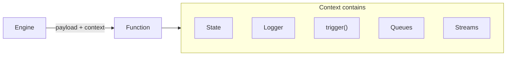

Context is the full state of a iii system and is what enables Functions to interact with anything available to the iii Engine such as state, databases, queues, Triggers, and logging.

When the Engine invokes a Function, it passes the current Context alongside the payload. This gives every Function access to the full set of system capabilities without needing to manage connections or dependencies directly.



## What Context Provides

| Capability | Description |
|------------|-------------|
| `trigger()` / `triggerVoid()` | Invoke any other registered Function |
| State operations | Read, write, update, delete shared state |
| Stream operations | Manage real-time data streams |
| Queue operations | Enqueue messages for async processing |
| PubSub | Publish and subscribe to topics |
| Logger | Structured logging with trace correlation |

## Using Context in Code

<Tabs items={["TypeScript", "Python"]}>
<Tab value="TypeScript">
```typescript
import { getContext } from '@iii-dev/sdk'

const ctx = getContext()
ctx.logger.info('Processing request', { userId: '123' })
```
</Tab>
<Tab value="Python">
```python
from iii import get_context

ctx = get_context()
ctx.logger.info('Processing request', {'user_id': '123'})
```
</Tab>
</Tabs>

<Callout title="Side Effects" type="info">
  The Context object makes it possible for any Function to trigger an invocation of any other Function within the iii Engine. This is how workflows, pipelines, and complex orchestration patterns emerge from simple Functions.
</Callout>

<Callout title="See also" type="info">
  For the full list of operations available through Context, see the individual module documentation: [State](/docs/modules/module-state), [Stream](/docs/modules/module-stream), [Queue](/docs/modules/module-queue), [PubSub](/docs/modules/module-pubsub), and [Observability](/docs/modules/module-observability).
</Callout>
