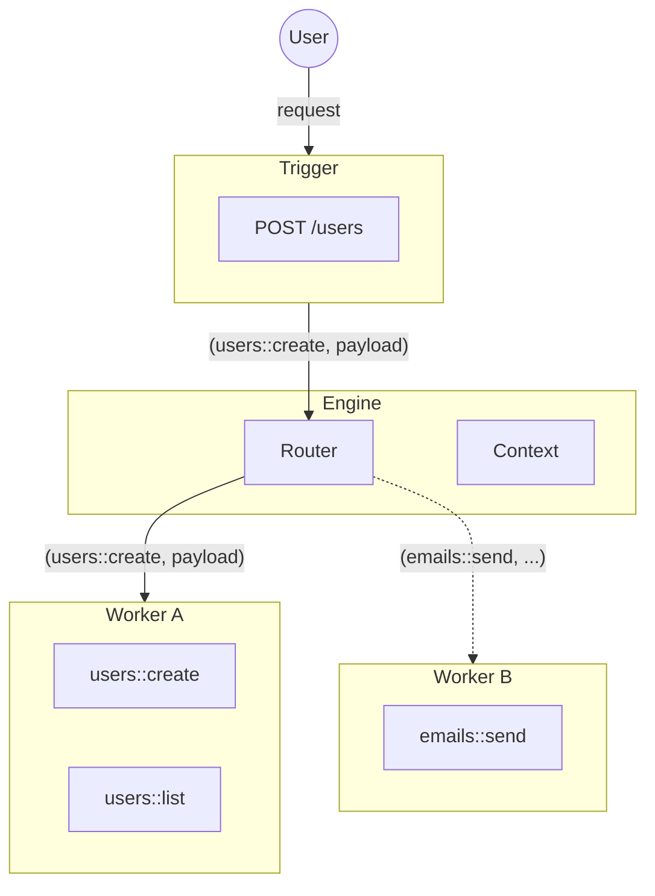

The Engine is the central orchestrator of a iii system. It knows where every part of your infrastructure lives and routes requests to those parts.

When a Trigger fires, the Engine handles the routing and sends the message to the Worker that contains the target Function. When a Function triggers another Function, the Engine resolves the target and delivers the payload, regardless of whether the target is in the same Worker, a different Worker, or a different machine entirely.



## Responsibilities

| Responsibility | Description |
|----------------|-------------|
| **Routing** | Resolves Function IDs to Workers and delivers payloads |
| **Context management** | Maintains shared system Context across all Workers |
| **Module orchestration** | Loads and initializes Modules from `config.yaml` |
| **Worker registry** | Tracks connected Workers and their registered Functions |
| **Trigger dispatch** | Receives trigger events and routes them to the correct Function |

## Architecture Agnostic

This architecture is what enables application code to be decoupled from the infrastructure it runs on. iii makes no distinction between cloud providers, colocated servers, serverless functions, domains, databases, and existing infrastructure.

A Function registered on Worker A can `trigger()` a Function on Worker B without knowing where Worker B is running. The Engine handles all routing transparently.

<Callout title="Context" type="info">
  In addition to orchestration, the Engine keeps track of the system's Context. This enables a shared context where any Function can access anything that the Engine has access to: state, queues, streams, and more.
</Callout>

## Configuration

The Engine is configured via `config.yaml` at the root of your project:

```yaml
port: 49134
modules:
  rest_api:
    port: 3000
  state:
    adapter: memory
  queue:
    adapter: memory
  observability:
    log_level: info
```

<Callout title="See also" type="info">
  For deployment options and production configuration, see [Deployment](/docs/advanced/deployment).
</Callout>
