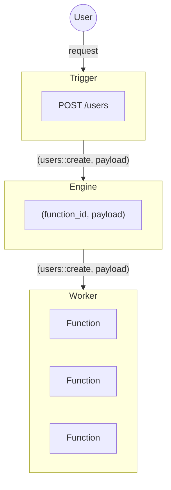

The Engine is primarily responsible for routing requests. When a Trigger fires, the Engine handles the routing and sends the message to the Worker that contains the target Function.

The iii Engine is the central orchestrator of a iii system. It knows where every part of your infrastructure lives and routes requests to those parts.

This architecture is what enables application code to be decoupled from the infrastructure it runs on. iii is completely architecture agnostic and makes no distinction between cloud providers, colocated servers, serverless functions, domains, databases, and existing infrastructure.

<Callout title="Context" type="info">
  In addition to orchestration the Engine also keeps track of the system's Context. This enables a shared context where
  any Function can access anything that the Engine has access to.
</Callout>
