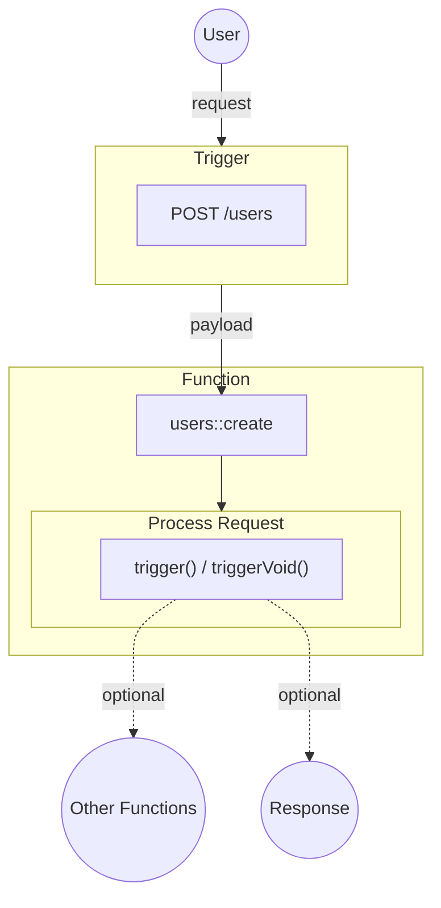

Functions are an abstraction on anything that can be registered and triggered — an actual function, an endpoint, or an external service. They can run anywhere, be written in any language, and use anything available to the iii engine. This makes it possible to incorporate existing systems into the Engine by registering them as Functions.

They accept a payload, and a context object, perform operations, and return a result.

The payload is the data that was passed from the Trigger to the Function.

The context object is how you access full system functionality such as state, logging, queueing, and triggering other Functions. If the iii engine has access to it then the context object will contain it.

<Callout title="Everything is a Function" type="info">
  Traditionally the backend has a mental model where functionality is separated by domain. For example a HTTP endpoint
  is an endpoint, not a function, despite being defined as a Function within any HTTP framework. iii's approach removes
  this arbitrary separation and the benefits that iii provides derive from that.
</Callout>
