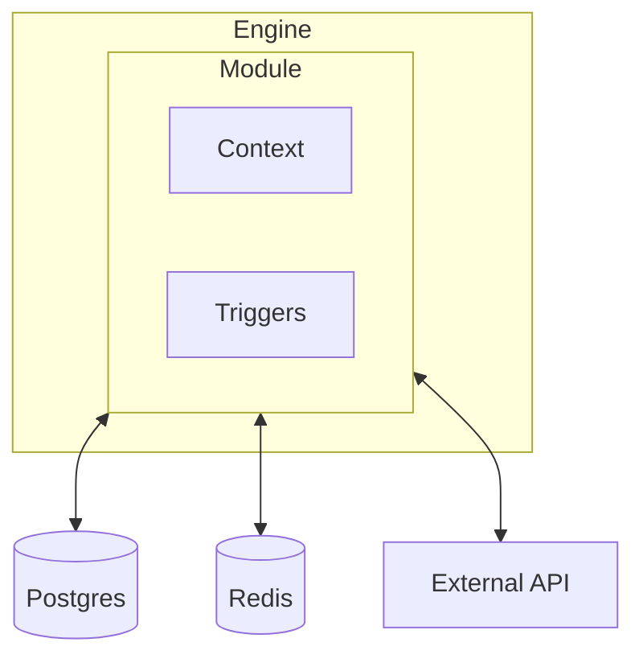

Modules are the interface between the Engine and the rest of the application. They are responsible for establishing connections to services, implementing trigger types, and supplying application Context.

Every capability in iii — HTTP endpoints, cron scheduling, state management, queues, streams, observability — is implemented as a Module. This modular architecture means the Engine itself stays small and focused on orchestration, while Modules handle all external concerns.



## Built-in Modules

| Module | Provides | Config key |
|--------|----------|------------|
| [REST API](/docs/modules/module-rest-api) | HTTP trigger type, request/response handling | `rest_api` |
| [Queue](/docs/modules/module-queue) | Async message processing with retries | `queue` |
| [Cron](/docs/modules/module-cron) | Scheduled task execution | `cron` |
| [State](/docs/modules/module-state) | Key-value state storage with atomic updates | `state` |
| [Stream](/docs/modules/module-stream) | Real-time data streams with WebSocket push | `stream` |
| [PubSub](/docs/modules/module-pubsub) | Publish/subscribe messaging | `pubsub` |
| [Observability](/docs/modules/module-observability) | Structured logging, tracing, and metrics | `observability` |
| [KV Server](/docs/modules/module-kv-server) | Standalone key-value HTTP API | `kv_server` |
| [Exec](/docs/modules/module-exec) | Shell command execution | `exec` |
| [Bridge](/docs/modules/module-bridge) | WebSocket bridge for SDK connections | `bridge` |

## How Modules Work

A Module has two responsibilities:

1. **Register trigger types** — A Module can introduce new ways to invoke Functions. For example, the REST API module registers the `http` trigger type, and the Cron module registers the `cron` trigger type.

2. **Supply Context** — A Module can add capabilities to the Context object that gets passed to every Function. For example, the State module adds `state::get`, `state::set`, and other state operations.

Modules are configured in `config.yaml`:

```yaml
modules:
  rest_api:
    port: 3000
  state:
    adapter: memory
  queue:
    adapter: memory
```

<Callout title="Custom Modules" type="info">
  You can build your own Modules to integrate any service or infrastructure. See [Custom Modules](/docs/advanced/custom-modules) for a detailed guide.
</Callout>
