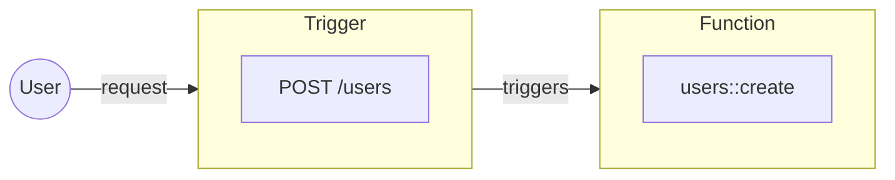

Triggers are entrypoints into an iii system.

Each Trigger defines the conditions which will cause it to fire, a payload it accepts, and a Function that it will trigger. When the Trigger fires, the Function is executed with that payload.

<Callout title="Unrolling the backend" type="info">
  Due to the way iii is structured there can be any amount of entrypoints into a system. This makes modification
  simpler, reduces complexity, and allows the adoption of any programming pattern into existing infrastructure.
</Callout>
