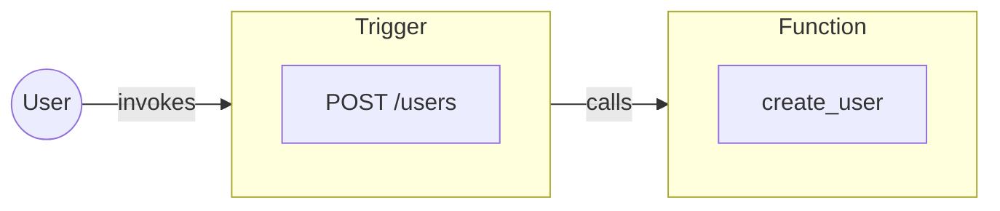

Triggers are entrypoints into an iii system.

Each Trigger defines the conditions which will cause it to fire, a payload it accepts, and a Function that it will invoke. When the Trigger does fire the Function is invoked with that payload.

The basic flow looks something like this, when Triggers are activated Functions are called, although there are a few more layers in between.

<Callout title="Unrolling the backend" type="info">
  Due to the way iii is structured there can be any amount of entrypoints into a system. This makes modification
  simpler, reduces complexity, and allows the adoption of any programming pattern into existing infrastructure.
</Callout>
