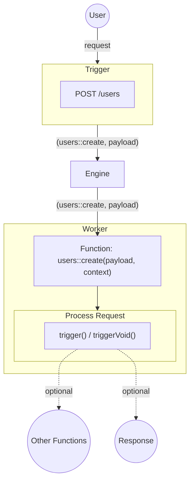
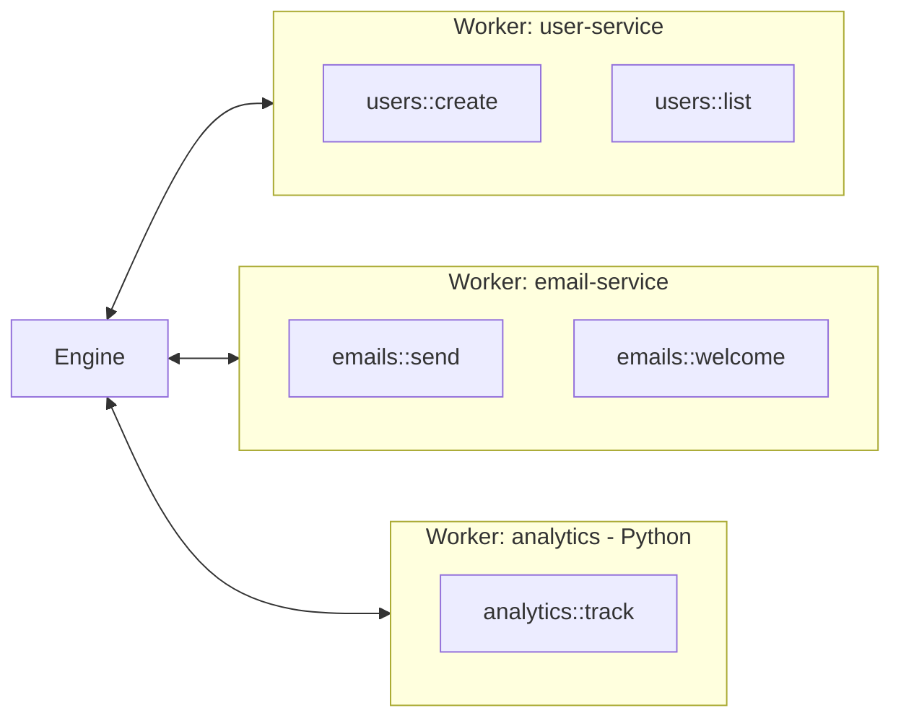

Workers are what handle Function invocation within iii.

When the Engine sends a Worker a request, the Worker executes that request and routes it to the correct Function. When the Function is done with its work it may optionally return a result to the Worker, or it may `trigger()` other Functions to continue the workflow.

Workers encapsulate the actual components of a iii system. They can encapsulate existing infrastructure, external services, or brand-new greenfield development.

Workers are what enables any sort of application architecture, with any combination of dependencies, services, and integrations.



## What Workers Do

| Responsibility | Description |
|----------------|-------------|
| **Function hosting** | Workers register Functions with the Engine and execute them when triggered |
| **SDK connection** | Each Worker connects to the Engine via WebSocket using an SDK |
| **Language runtime** | Workers run in their own process and can use any language (TypeScript, Python, Rust) |
| **Isolation** | Each Worker is an independent process. Crashes in one Worker don't affect others |

## Creating a Worker

A Worker is any process that connects to the iii Engine using an SDK and registers Functions.

<Tabs items={["TypeScript", "Python", "Rust"]}>
<Tab value="TypeScript">
```typescript
import { init } from '@iii-dev/sdk'

const iii = init('ws://localhost:49134', { workerName: 'user-service' })

iii.registerFunction(
  { function_path: 'users::create' },
  async (data) => {
    const user = await db.createUser(data)
    iii.triggerVoid('emails::welcome', { to: user.email })
    return user
  }
)
```
</Tab>
<Tab value="Python">
```python
import asyncio
from iii import III

async def main():
    iii = III('ws://localhost:49134')

    async def create_user(data):
        user = await db.create_user(data)
        iii.trigger_void('emails::welcome', {'to': user['email']})
        return user

    iii.register_function('users::create', create_user)
    await iii.connect()

asyncio.run(main())
```
</Tab>
<Tab value="Rust">
```rust
use iii::III;
use serde_json::{json, Value};
use std::sync::Arc;

let iii = Arc::new(III::new("ws://localhost:49134"));
let iii_clone = iii.clone();

iii.register_function("users::create", move |data: Value| {
    let iii = iii_clone.clone();
    async move {
        let user = db::create_user(&data).await?;
        iii.trigger_void("emails::welcome", json!({"to": user.email}))?;
        Ok(json!(user))
    }
});

iii.connect().await?;
```
</Tab>
</Tabs>

## Multi-Worker Architecture

A iii system typically has multiple Workers, each responsible for a different domain or written in a different language. The Engine handles all inter-Worker communication transparently.



<Callout title="See also" type="info">
  For details on how to build and deploy Workers, see the [Quickstart tutorial](/docs/tutorials/quickstart) or the [SDK Reference](/docs/api-reference/iii-sdk).
</Callout>
