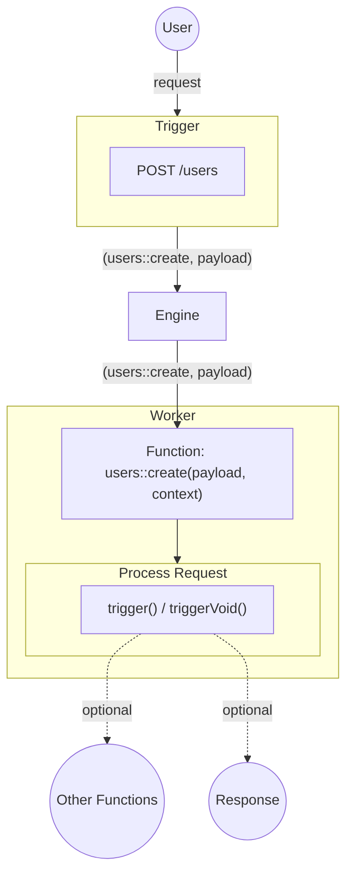

Workers are what handle Function invocation within iii.

When the Engine sends a Worker a request, the Worker executes that request and routes it to the correct Function. When the Function is done with its work it may optionally return a result to the Worker, or it may `trigger()` other Functions to continue the workflow.

Workers encapsulate the actual components of a iii system. They can encapsulate existing infrastructure, external services, or brand new green field development.

Workers are what enables any sort of application architecture, with any combination of dependencies, services, and integrations.

