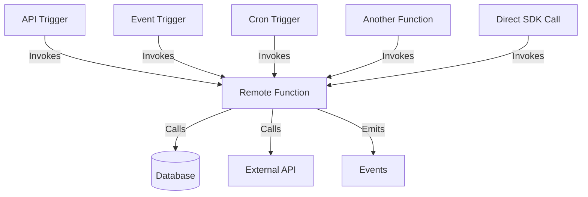
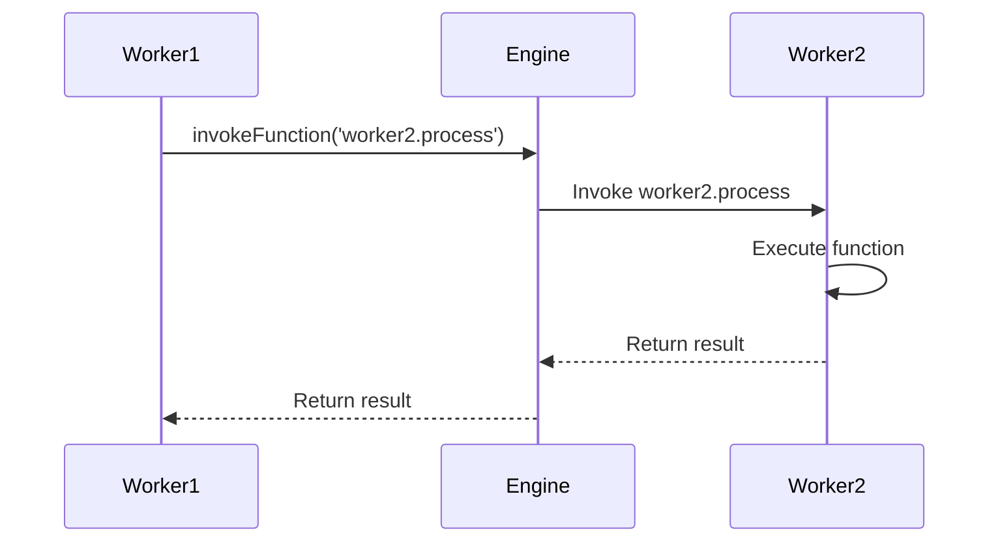

Remote Functions are the building blocks of iii applications - arbitrary functions that can be executed from anywhere in the system.

## What are Remote Functions?

A **Remote Function** is a function registered with the iii Engine that can be invoked:

- By triggers (API requests, events, cron schedules)
- By other functions
- Directly via the SDK



## Function Registration

Functions are registered by workers during initialization:

```typescript
bridge.registerFunction({
  function_path: 'service.action',
  handler: async (data) => {
    // Function logic here
    return result
  },
  description: 'Optional description',
  metadata: { version: '1.0' }, // Optional metadata
})
```

### Function Path

The `function_path` is a unique identifier using dot notation:

**Pattern**: `service.action`

**Examples**:

- `users.create`
- `users.update`
- `auth.login`
- `payments.process`
- `api.echo`

**Best Practices**:

- Use lowercase
- Use dots to separate service and action
- Be descriptive but concise
- Version if needed: `users.create.v2`

## Function Handler

The handler is an async function that receives input data:

```typescript
async function handler(data: any) {
  // Access input data
  const { name, email } = data

  // Perform business logic
  const result = await processData(name, email)

  // Return result
  return result
}
```

### Input Data

The structure of `data` depends on the trigger type:

| Trigger Type | Data Structure                                             |
| ------------ | ---------------------------------------------------------- |
| **api**      | `ApiRequest` with path_params, query_params, body, headers |
| **event**    | Event payload (any JSON)                                   |
| **cron**     | Cron execution context                                     |
| **log**      | Log entry object                                           |
| **direct**   | Whatever was passed to `invokeFunction`                    |

### Return Value

Functions should return:

- **API triggers**: `ApiResponse` with status, body, headers
- **Event triggers**: Any JSON value (or void)
- **Cron triggers**: Any JSON value (or void)
- **Direct calls**: Any JSON value

## Function Invocation

### Via Triggers

Most common pattern - triggers automatically invoke functions:

```typescript
// 1. Register function
bridge.registerFunction({
  function_path: 'users.create',
  handler: async (req) => {
    const user = await db.createUser(req.body)
    return { status: 201, body: user }
  },
})

// 2. Register trigger
bridge.registerTrigger({
  trigger_type: 'api',
  function_path: 'users.create',
  config: { api_path: '/users', http_method: 'POST' },
})

// 3. Function is invoked when HTTP POST /users is received
```

### Direct Invocation

Call functions directly from other functions:

```typescript
bridge.registerFunction({
  function_path: 'users.sendWelcome',
  handler: async (user) => {
    await sendEmail(user.email, 'Welcome!')
  },
})

bridge.registerFunction({
  function_path: 'users.create',
  handler: async (data) => {
    const user = await db.createUser(data)

    // Invoke another function
    await bridge.invokeFunction({
      function_path: 'users.sendWelcome',
      data: user,
    })

    return user
  },
})
```

### Cross-Worker Invocation

Functions can invoke functions in other workers:



```typescript
// Worker 1 - API handler
bridge.registerFunction({
  function_path: 'api.processOrder',
  handler: async (req) => {
    // Call function in Worker 2
    const result = await bridge.invokeFunction({
      function_path: 'payments.charge', // In Worker 2
      data: { amount: req.body.amount },
    })

    return { status: 200, body: result }
  },
})

// Worker 2 - Payment processor
bridge.registerFunction({
  function_path: 'payments.charge',
  handler: async ({ amount }) => {
    const charge = await stripe.charge(amount)
    return { chargeId: charge.id }
  },
})
```

## Function Schemas

Define input/output schemas for documentation and validation:

```typescript
bridge.registerFunction({
  function_path: 'users.create',
  handler: async (data) => {
    /* ... */
  },
  description: 'Create a new user account',
  request_format: {
    type: 'object',
    properties: {
      name: { type: 'string' },
      email: { type: 'string', format: 'email' },
      age: { type: 'number', minimum: 18 },
    },
    required: ['name', 'email'],
  },
  response_format: {
    type: 'object',
    properties: {
      id: { type: 'string' },
      name: { type: 'string' },
      email: { type: 'string' },
    },
  },
})
```

## Error Handling

Functions should handle errors gracefully:

```typescript
bridge.registerFunction({
  function_path: 'users.create',
  handler: async (req) => {
    try {
      // Validate input
      if (!req.body.email) {
        return {
          status: 400,
          body: { error: 'Email is required' },
        }
      }

      // Perform operation
      const user = await db.createUser(req.body)

      return {
        status: 201,
        body: user,
      }
    } catch (error) {
      // Log error
      logger.error('Failed to create user:', error)

      // Return error response
      return {
        status: 500,
        body: {
          error: 'Internal server error',
          message: error.message,
        },
      }
    }
  },
})
```

## Common Patterns

### CRUD Operations

```typescript
// Create
bridge.registerFunction({
  function_path: 'users.create',
  handler: async (req) => {
    const user = await db.insert(req.body)
    return { status: 201, body: user }
  },
})

// Read
bridge.registerFunction({
  function_path: 'users.get',
  handler: async (req) => {
    const user = await db.findById(req.path_params.id)
    if (!user) return { status: 404, body: { error: 'Not found' } }
    return { status: 200, body: user }
  },
})

// Update
bridge.registerFunction({
  function_path: 'users.update',
  handler: async (req) => {
    const user = await db.update(req.path_params.id, req.body)
    return { status: 200, body: user }
  },
})

// Delete
bridge.registerFunction({
  function_path: 'users.delete',
  handler: async (req) => {
    await db.delete(req.path_params.id)
    return { status: 204, body: null }
  },
})
```

### Event Emission

```typescript
bridge.registerFunction({
  function_path: 'orders.create',
  handler: async (req) => {
    // Create order
    const order = await db.createOrder(req.body)

    // Emit event
    await bridge.invokeFunction({
      function_path: 'enqueue',
      data: {
        topic: 'order.created',
        data: order,
      },
    })

    return { status: 201, body: order }
  },
})
```

### Function Composition

```typescript
// Utility function
bridge.registerFunction({
  function_path: 'utils.validateEmail',
  handler: async ({ email }) => {
    return /^[^\s@]+@[^\s@]+\.[^\s@]+$/.test(email)
  },
})

// Main function using utility
bridge.registerFunction({
  function_path: 'users.create',
  handler: async (req) => {
    // Call utility function
    const isValid = await bridge.invokeFunction({
      function_path: 'utils.validateEmail',
      data: { email: req.body.email },
    })

    if (!isValid) {
      return { status: 400, body: { error: 'Invalid email' } }
    }

    // Continue with creation
    const user = await db.createUser(req.body)
    return { status: 201, body: user }
  },
})
```

### Background Jobs

```typescript
bridge.registerFunction({
  function_path: 'api.processLarge',
  handler: async (req) => {
    // Queue background job (fire and forget)
    bridge
      .invokeFunction({
        function_path: 'jobs.processData',
        data: req.body,
      })
      .catch((err) => console.error('Job failed:', err))

    // Return immediately
    return {
      status: 202,
      body: { message: 'Processing started' },
    }
  },
})

bridge.registerFunction({
  function_path: 'jobs.processData',
  handler: async (data) => {
    // Long-running process
    await processLargeDataset(data)

    // Emit completion event
    await bridge.invokeFunction({
      function_path: 'publish',
      data: {
        topic: 'processing.completed',
        data: { jobId: data.id },
      },
    })
  },
})
```

## Best Practices

<AccordionGroup>
  <Accordion title="Keep Functions Focused">
    Each function should have a single responsibility:

    ```typescript
    // Good: Focused functions
    bridge.registerFunction({ function_path: 'users.create', ... });
    bridge.registerFunction({ function_path: 'users.sendWelcome', ... });

    // Avoid: Doing too much in one function
    bridge.registerFunction({
      function_path: 'users.createAndEmailAndLog',
      handler: async (data) => {
        const user = await createUser(data);
        await sendEmail(user);
        await logActivity(user);
        await updateMetrics(user);
        // Too many responsibilities
      }
    });
    ```

  </Accordion>

  <Accordion title="Use Consistent Naming">
    Follow a naming convention across your application:

    ```typescript
    // Resource.action pattern
    'users.create'
    'users.update'
    'orders.process'
    'payments.charge'

    // Or service.resource.action for larger apps
    'api.users.create'
    'api.orders.list'
    'jobs.cleanup.old'
    ```

  </Accordion>

  <Accordion title="Return Structured Errors">
    Always return consistent error formats:

    ```typescript
    // Good
    return {
      status: 400,
      body: {
        error: 'VALIDATION_ERROR',
        message: 'Email is required',
        field: 'email'
      }
    };

    // Avoid: Inconsistent error responses
    return { status: 400, body: 'bad request' };
    ```

  </Accordion>

  <Accordion title="Log Important Events">
    Use the logger for debugging and monitoring:

    ```typescript
    import { logger } from '@iii-dev/sdk';

    bridge.registerFunction({
      function_path: 'payments.charge',
      handler: async (data) => {
        logger.info('Processing payment', data);

        try {
          const result = await processPayment(data);
          logger.info('Payment successful', result);
          return result;
        } catch (error) {
          logger.error('Payment failed', error);
          throw error;
        }
      }
    });
    ```

  </Accordion>
</AccordionGroup>

## Next Steps

<Columns cols={2}>
  <Card icon={<Recycle />} title="Triggers" href="/docs/using/triggers">
    Learn how to connect functions to triggers
  </Card>
  <Card icon={<Code />} title="Quick Start" href="/docs/tutorials/quickstart">
    Build your first iii application
  </Card>
</Columns>
