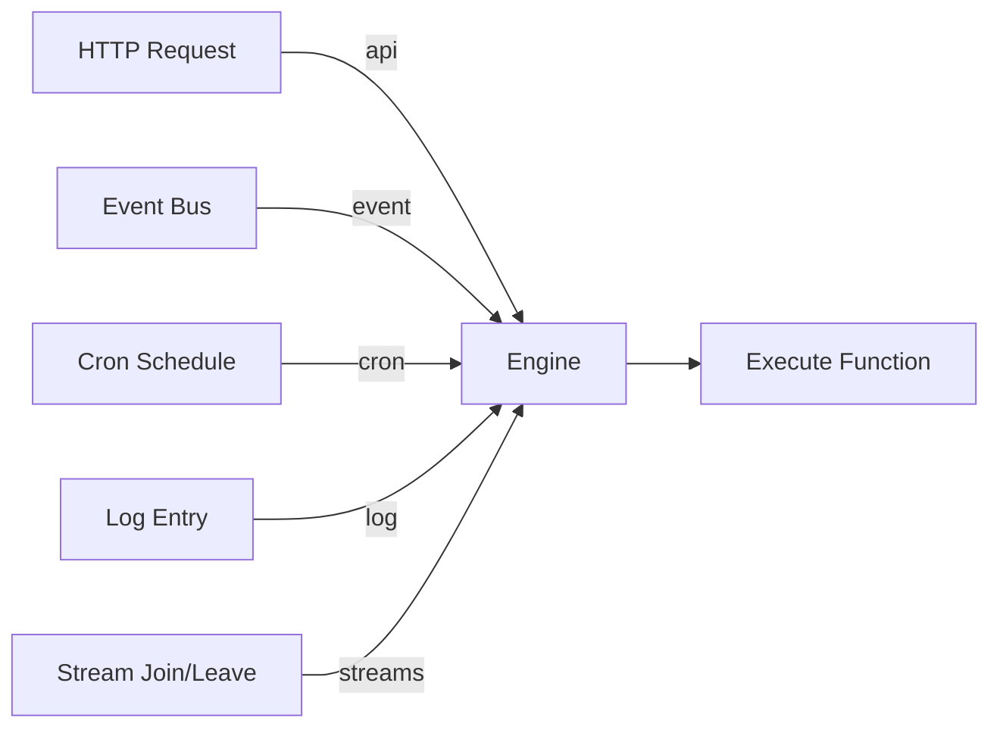
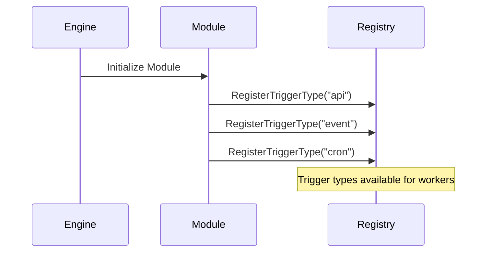

Trigger Types define different ways to invoke functions in the iii Engine.

## What are Trigger Types?

A Trigger Type is a mechanism that can initiate function execution. The iii Engine supports multiple trigger types, each serving different use cases:

- **[API](/docs/modules/module-rest-api)**: HTTP requests
- **[Event](/docs/modules/module-event)**: Published events on topics
- **[Cron](/docs/modules/module-cron)**: Scheduled time-based execution
- **[Log](/docs/modules/module-logging)**: System log events
- **[Streams](/docs/modules/module-stream)**: Stream connection lifecycle (join/leave)



## Core Trigger Types

### API Trigger (`api`)

Executes functions in response to HTTP requests.

**Provided by**: [REST API Module](/docs/modules/module-rest-api)

**Configuration:**

```typescript
{
  trigger_type: 'api',
  config: {
    api_path: '/users/:id',
    http_method: 'GET'
  }
}
```

**Input**: `ApiRequest` with path params, query params, body, headers

**Output**: `ApiResponse` with status, body, headers

<Card icon={<Globe />} title="REST API Module" href="/docs/modules/module-rest-api">
  Learn more about the API trigger
</Card>

---

### Event Trigger (`event`)

Executes functions when events are published to subscribed topics.

**Provided by**: [Event Module](/docs/modules/module-event)

**Configuration:**

```typescript
{
  trigger_type: 'queue',
  config: {
    topic: 'user.created'
  }
}
```

**Input**: Event payload (any JSON data)

**Output**: Function result (optional, fire-and-forget pattern supported)

<Card icon={<Zap />} title="Event Module" href="/docs/modules/module-event">
  Learn more about the Event trigger
</Card>

---

### Cron Trigger (`cron`)

Executes functions on a time-based schedule using cron expressions.

**Provided by**: [Cron Module](/docs/modules/module-cron)

**Configuration:**

```typescript
{
  trigger_type: 'cron',
  config: {
    cron: '0 2 * * *'  // Every day at 2 AM
  }
}
```

**Input**: Cron execution context (timestamp, trigger info)

**Output**: Function result

<Card icon={<Clock />} title="Cron Module" href="/docs/modules/module-cron">
  Learn more about the Cron trigger
</Card>

---

### Log Trigger (`log`)

Executes functions when log entries match specified criteria.

**Provided by**: [Logging Module](/docs/modules/module-logging)

**Configuration:**

```typescript
{
  trigger_type: 'log',
  config: {
    level: 'error'  // info, warn, error, debug
  }
}
```

**Input**: Log entry with trace_id, message, level, function_name, date

**Output**: Function result (useful for alerting, metrics)

<Card icon={<FileText />} title="Logging Module" href="/docs/modules/module-logging">
  Learn more about the Log trigger
</Card>

---

### Stream Triggers (`streams:join`, `streams:leave`)

Executes functions when clients connect to or disconnect from streams.

**Provided by**: [Stream Module](/docs/modules/module-stream)

**Configuration:**

```typescript
// Join trigger
{
  trigger_type: 'streams:join',
  config: {}  // No config needed
}

// Leave trigger
{
  trigger_type: 'streams:leave',
  config: {}  // No config needed
}
```

**Input**: Subscription info with stream_name, group_id, item_id, context

**Output**: Function result (useful for access control, analytics)

<Card icon={<Activity />} title="Stream Module" href="/docs/modules/module-stream">
  Learn more about Stream triggers
</Card>

## Trigger Type Comparison

| Trigger Type      | Use Case              | Synchronous | Multiple Subscribers    |
| ----------------- | --------------------- | ----------- | ----------------------- |
| **api**           | HTTP endpoints        | ✓ Yes       | ✗ No (1:1 mapping)      |
| **event**         | Pub/sub messaging     | ✗ No        | ✓ Yes                   |
| **cron**          | Scheduled tasks       | ✗ No        | ✗ No (distributed lock) |
| **log**           | Log monitoring        | ✗ No        | ✓ Yes                   |
| **streams:join**  | Stream connections    | ✗ No        | ✓ Yes                   |
| **streams:leave** | Stream disconnections | ✗ No        | ✓ Yes                   |

## Registering Trigger Types

Trigger types are registered by Core Modules during engine initialization:



Workers can then register triggers using these types:

```typescript
bridge.registerTrigger({
  trigger_type: 'api', // Must be a registered trigger type
  function_path: 'users.create',
  config: {
    /* trigger-specific config */
  },
})
```

## Custom Trigger Types

Modules can register custom trigger types by implementing the trigger interface:

```rust
pub struct CustomModule {
    // Module state
}

impl CoreModule for CustomModule {
    fn name(&self) -> &str {
        "custom"
    }

    async fn register_trigger_type(&self, registry: &TriggerRegistry) {
        registry.register("custom:trigger", CustomTriggerHandler);
    }
}
```

## Usage Patterns

### HTTP API Endpoints

```typescript
// Register function
bridge.registerFunction({
  function_path: 'api.getUser',
  handler: async (req) => ({
    status: 200,
    body: { user: { id: req.path_params.id } },
  }),
})

// Register API trigger
bridge.registerTrigger({
  trigger_type: 'api',
  function_path: 'api.getUser',
  config: {
    api_path: '/users/:id',
    http_method: 'GET',
  },
})
```

### Event-Driven Workflows

```typescript
// Emit events
await bridge.invokeFunction({
  function_path: 'enqueue',
  data: {
    topic: 'order.placed',
    data: { orderId: '123', amount: 99.99 },
  },
})

// Subscribe to events
bridge.registerFunction({
  function_path: 'notifications.sendOrderEmail',
  handler: async (data) => {
    await sendEmail(data)
  },
})

bridge.registerTrigger({
  trigger_type: 'queue',
  function_path: 'notifications.sendOrderEmail',
  config: {
    subscribes: ['order.placed'],
  },
})
```

### Scheduled Jobs

```typescript
bridge.registerFunction({
  function_path: 'jobs.dailyReport',
  handler: async () => {
    const report = await generateReport()
    await sendReport(report)
  },
})

bridge.registerTrigger({
  trigger_type: 'cron',
  function_path: 'jobs.dailyReport',
  config: {
    cron: '0 9 * * *', // Every day at 9 AM
  },
})
```

## Next Steps

<Columns cols={2}>
  <Card icon={<Recycle />} title="Triggers" href="/docs/using/triggers">
    Learn how to register and configure triggers
  </Card>
  <Card icon={<Blocks />} title="Core Modules" href="/docs/modules">
    Explore modules that provide trigger types
  </Card>
</Columns>
