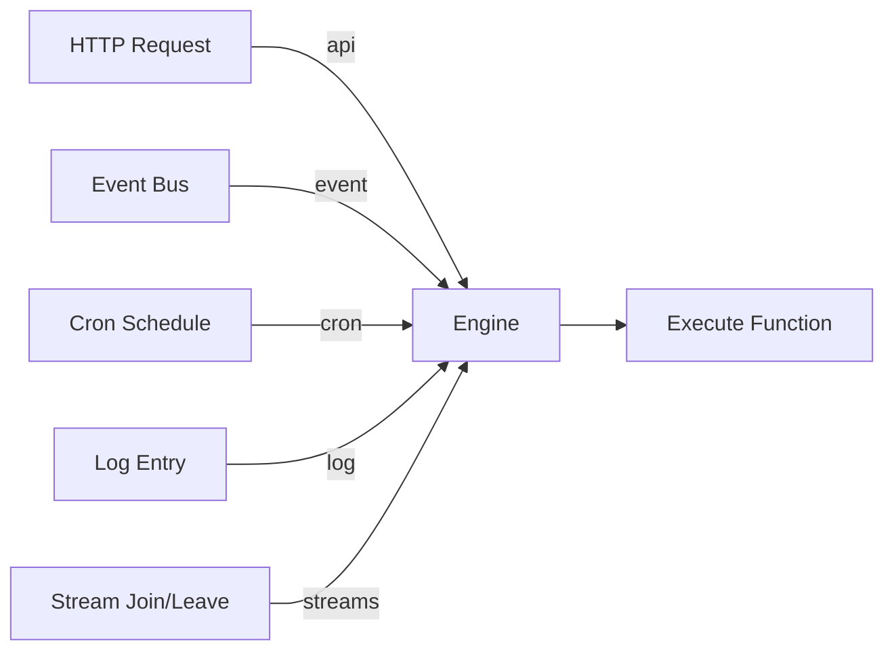
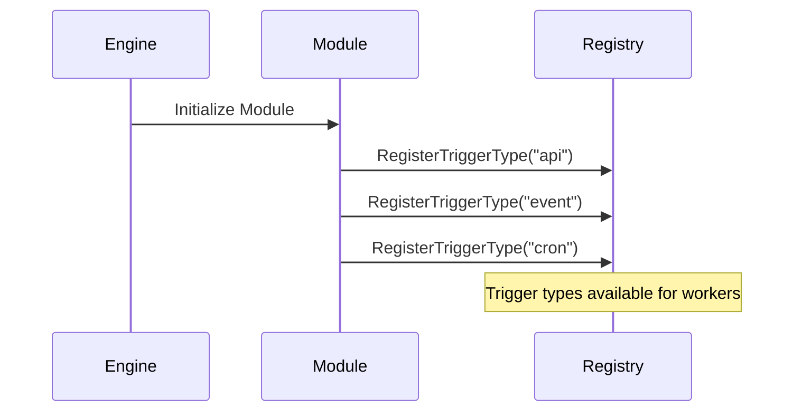

Trigger Types define different ways to invoke functions in the iii Engine.

## What are Trigger Types?

A Trigger Type is a mechanism that can initiate function execution. The iii Engine supports multiple trigger types, each serving different use cases:

- **[API](/docs/modules/module-rest-api)**: HTTP requests
- **[Queue](/docs/modules/module-queue)**: Published events on topics
- **[Cron](/docs/modules/module-cron)**: Scheduled time-based execution
- **[Log](/docs/modules/module-observability)**: System log events
- **[Streams](/docs/modules/module-stream)**: Stream connection lifecycle (join/leave)



## Core Trigger Types

### API Trigger (`api`)

Executes functions in response to HTTP requests.

**Provided by**: [REST API Module](/docs/modules/module-rest-api)

**Configuration:**

```typescript
{
  type: 'http',
  config: {
    api_path: '/users/:id',
    http_method: 'GET'
  }
}
```

**Input**: `ApiRequest` with path params, query params, body, headers

**Output**: `ApiResponse` with status_code, body, headers

**Conditions**: Optional. Add `_condition_path` to config with a function ID. The engine invokes it before the handler; if it returns `false`, the handler is skipped. See [Trigger Conditions](/docs/using/triggers#trigger-conditions).

<Card icon={<Globe />} title="REST API Module" href="/docs/modules/module-rest-api">
  Learn more about the API trigger
</Card>

---

### Event Trigger (`event`)

Executes functions when events are published to subscribed topics.

**Provided by**: [Queue Module](/docs/modules/module-queue)

**Configuration:**

```typescript
{
  type: 'queue',
  function_id: fn.id,
  config: {
    topic: 'user.created'
  }
}
```

**Input**: Event payload (any JSON data)

**Output**: Function result (optional, fire-and-forget pattern supported)

**Conditions**: Optional. Add `_condition_path` to config. See [Trigger Conditions](/docs/using/triggers#trigger-conditions).

<Card icon={<Zap />} title="Queue Module" href="/docs/modules/module-queue">
  Learn more about the Queue trigger
</Card>

---

### Cron Trigger (`cron`)

Executes functions on a time-based schedule using cron expressions.

**Provided by**: [Cron Module](/docs/modules/module-cron)

**Configuration:**

```typescript
{
  type: 'cron',
  function_id: fn.id,
  config: {
    cron: '0 2 * * *'
  }
}
```

**Input**: Cron execution context (timestamp, trigger info)

**Output**: Function result

**Conditions**: Optional. Add `condition_function_id` to config. See [Trigger Conditions](/docs/using/triggers#trigger-conditions).

<Card icon={<Clock />} title="Cron Module" href="/docs/modules/module-cron">
  Learn more about the Cron trigger
</Card>

---

### Log Trigger (`log`)

Executes functions when log entries match specified criteria.

**Provided by**: [Observability Module](/docs/modules/module-observability)

**Configuration:**

```typescript
{
  type: 'log',
  function_id: fn.id,
  config: {
    level: 'error'
  }
}
```

**Input**: Log entry with trace_id, message, level, function_name, date

**Output**: Function result (useful for alerting, metrics)

<Card icon={<FileText />} title="Observability Module" href="/docs/modules/module-observability">
  Learn more about the Log trigger
</Card>

---

### Stream Triggers (`stream:join`, `stream:leave`)

Executes functions when clients connect to or disconnect from streams.

**Provided by**: [Stream Module](/docs/modules/module-stream)

**Configuration:**

```typescript
{
  type: 'stream:join',
  function_id: fn.id,
  config: {}
}

{
  type: 'stream:leave',
  function_id: fn.id,
  config: {}
}
```

**Input**: Subscription info with stream_name, group_id, item_id, context

**Output**: Function result (useful for access control, analytics)

**Conditions**: Optional. Add `condition_function_id` to config for stream:join/stream:leave. See [Trigger Conditions](/docs/using/triggers#trigger-conditions).

<Card icon={<Activity />} title="Stream Module" href="/docs/modules/module-stream">
  Learn more about Stream triggers
</Card>

## Trigger Type Comparison

| Trigger Type      | Use Case              | Synchronous | Multiple Subscribers    |
| ----------------- | --------------------- | ----------- | ----------------------- |
| **api**           | HTTP endpoints        | ✓ Yes       | ✗ No (1:1 mapping)      |
| **event**         | Pub/sub messaging     | ✗ No        | ✓ Yes                   |
| **cron**          | Scheduled tasks       | ✗ No        | ✗ No (distributed lock) |
| **log**           | Log monitoring        | ✗ No        | ✓ Yes                   |
| **stream:join**  | Stream connections    | ✗ No        | ✓ Yes                   |
| **stream:leave** | Stream disconnections | ✗ No        | ✓ Yes                   |

## Registering Trigger Types

Trigger types are registered by Core Modules during engine initialization:



Workers can then register triggers using these types:

```typescript
const fn = iii.registerFunction({ id: 'api.getUser' }, handler)
iii.registerTrigger({
  type: 'http',
  function_id: fn.id,
  config: {
    api_path: '/users/:id',
    http_method: 'GET',
  },
})
```

## Custom Trigger Types

Modules can register custom trigger types by implementing the trigger interface:

```rust
pub struct CustomModule {
    // Module state
}

impl CoreModule for CustomModule {
    fn name(&self) -> &str {
        "custom"
    }

    async fn register_trigger_type(&self, registry: &TriggerRegistry) {
        registry.register("custom:trigger", CustomTriggerHandler);
    }
}
```

## Usage Patterns

### HTTP API Endpoints

```typescript
const fn = iii.registerFunction({ id: 'api.getUser' }, async (req) => ({
  status_code: 200,
  body: { user: { id: req.path_params?.id } },
}))

iii.registerTrigger({
  type: 'http',
  function_id: fn.id,
  config: {
    api_path: '/users/:id',
    http_method: 'GET',
  },
})
```

### Event-Driven Workflows

```typescript
await iii.call('enqueue', {
  topic: 'order.placed',
  data: { orderId: '123', amount: 99.99 },
})

const fn = iii.registerFunction({ id: 'notifications.sendOrderEmail' }, async (data) => {
  await sendEmail(data)
})

iii.registerTrigger({
  type: 'queue',
  function_id: fn.id,
  config: {
    topic: 'order.placed',
  },
})
```

### Scheduled Jobs

```typescript
const fn = iii.registerFunction({ id: 'jobs.dailyReport' }, async () => {
  const report = await generateReport()
  await sendReport(report)
})

iii.registerTrigger({
  type: 'cron',
  function_id: fn.id,
  config: {
    cron: '0 9 * * *',
  },
})
```

## Next Steps

<Columns cols={2}>
  <Card icon={<Recycle />} title="Triggers" href="/docs/using/triggers">
    Learn how to register and configure triggers
  </Card>
  <Card icon={<Blocks />} title="Core Modules" href="/docs/modules">
    Explore modules that provide trigger types
  </Card>
</Columns>
