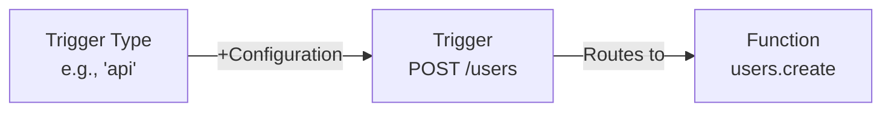
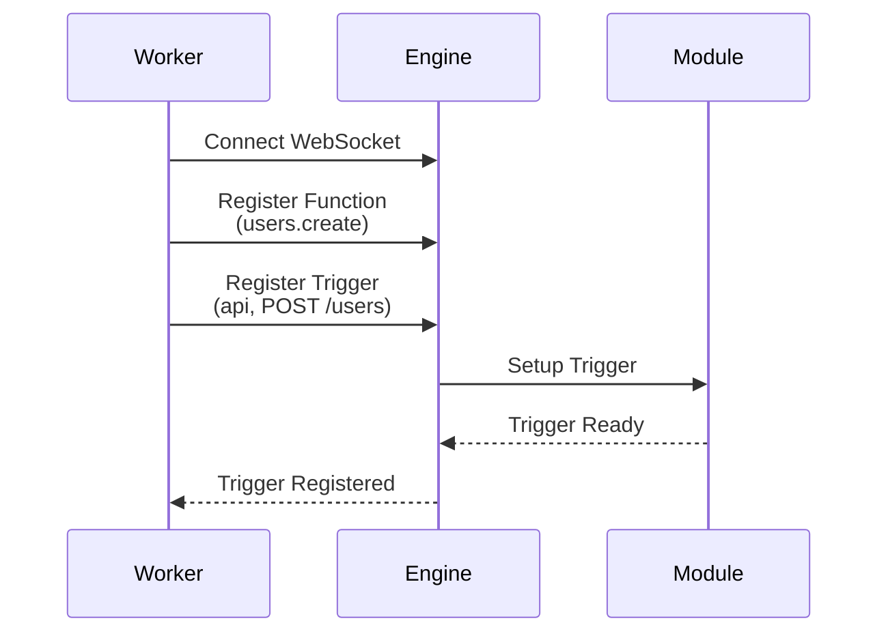
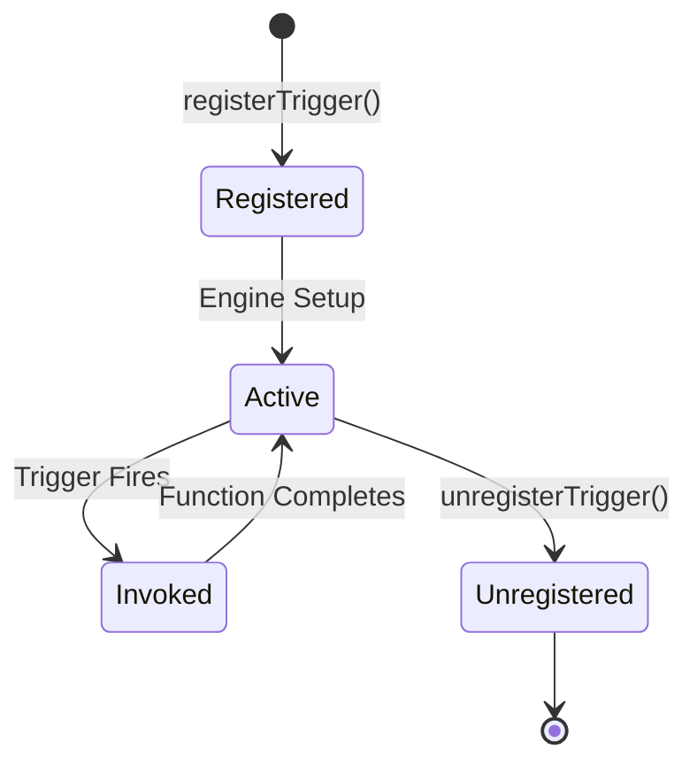

Triggers connect Trigger Types to Functions, creating the link between events and execution.

## What are Triggers?

A **Trigger** is a configured instance of a **Trigger Type** that routes invocations to a specific **Function**.



**Key Concept**: Triggers decouple _what initiates an action_ (Trigger Type) from _what logic runs_ (Function).

## Trigger Components

A trigger consists of three parts:

1. **Trigger Type**: The mechanism that initiates execution (api, event, cron, log)
2. **Configuration**: Type-specific settings (path, schedule, topics)
3. **Function Path**: The function to invoke when triggered

```typescript
bridge.registerTrigger({
  trigger_type: 'api', // 1. Trigger Type
  config: {
    // 2. Configuration
    api_path: '/users',
    http_method: 'POST',
  },
  function_path: 'users.create', // 3. Function Path
})
```

## Registering Triggers

Triggers are registered by workers after establishing a connection to the engine:



### Registration Flow

**Step 1: Register Function**

First, register the function that will be invoked:

```typescript
bridge.registerFunction({
  function_path: 'users.create',
  handler: async (data) => {
    // Function logic
    return { id: '123', ...data }
  },
})
```

**Step 2: Register Trigger**

Then, register a trigger that routes to that function:

```typescript
bridge.registerTrigger({
  trigger_type: 'api',
  function_path: 'users.create', // Must match registered function
  config: {
    api_path: '/users',
    http_method: 'POST',
  },
})
```

**Step 3: Trigger Active**

The engine sets up the trigger in the appropriate module. Now when an HTTP POST request comes to `/users`, the `users.create` function will be invoked.

## Trigger Configurations by Type

### API Trigger Configuration

```typescript
{
  trigger_type: 'api',
  function_path: 'api.endpoint',
  config: {
    api_path: '/api/v1/resource/:id',  // Supports path parameters
    http_method: 'GET' | 'POST' | 'PUT' | 'DELETE' | 'PATCH'
  }
}
```

**Path Parameters**: Extract values from URL

```typescript
// Trigger: api_path: '/users/:userId/posts/:postId'
// Request: GET /users/123/posts/456
// Handler receives: { path_params: { userId: '123', postId: '456' } }
```

### Event Trigger Configuration

```typescript
{
  trigger_type: 'event',
  function_path: 'events.handler',
  config: {
    subscribes: [
      'user.created',
      'user.updated',
      'user.deleted'
    ]
  }
}
```

**Multiple Subscriptions**: One trigger can subscribe to multiple topics.

### Cron Trigger Configuration

```typescript
{
  trigger_type: 'cron',
  function_path: 'jobs.scheduled',
  config: {
    cron: '*/5 * * * *'  // Every 5 minutes
  }
}
```

**Cron Expression**: Standard 5-field format (minute hour day month weekday)

### Log Trigger Configuration

```typescript
{
  trigger_type: 'log',
  function_path: 'monitoring.onError',
  config: {
    level: 'error'  // Optional: filter by log level
  }
}
```

**Log Levels**: `info`, `warn`, `error`, `debug` (omit to receive all levels)

### Stream Trigger Configuration

```typescript
{
  trigger_type: 'streams:join',
  function_path: 'streams.onJoin',
  config: {}  // No configuration needed
}
```

## Multiple Triggers to One Function

A single function can have multiple triggers:

```typescript
// Register function once
bridge.registerFunction({
  function_path: 'users.notify',
  handler: async (data) => {
    await sendNotification(data)
  },
})

// Trigger from API
bridge.registerTrigger({
  trigger_type: 'api',
  function_path: 'users.notify',
  config: { api_path: '/notify', http_method: 'POST' },
})

// Trigger from events
bridge.registerTrigger({
  trigger_type: 'event',
  function_path: 'users.notify',
  config: { subscribes: ['user.created', 'order.placed'] },
})

// Trigger from cron
bridge.registerTrigger({
  trigger_type: 'cron',
  function_path: 'users.notify',
  config: { cron: '0 9 * * *' },
})
```

**Use Case**: Send notifications via API calls, events, or scheduled jobs using the same logic.

## Trigger Lifecycle



### Unregistering Triggers

Remove triggers dynamically:

```typescript
const triggerId = 'unique-trigger-id'

bridge.registerTrigger({
  id: triggerId,
  trigger_type: 'api',
  function_path: 'api.temp',
  config: { api_path: '/temp', http_method: 'GET' },
})

// Later...
bridge.unregisterTrigger(triggerId)
```

## Trigger Patterns

### Webhook Handler

```typescript
bridge.registerFunction({
  function_path: 'webhooks.github',
  handler: async (req) => {
    const event = req.headers['x-github-event']
    const payload = req.body

    await processGitHubWebhook(event, payload)

    return { status: 200, body: { received: true } }
  },
})

bridge.registerTrigger({
  trigger_type: 'api',
  function_path: 'webhooks.github',
  config: {
    api_path: '/webhooks/github',
    http_method: 'POST',
  },
})
```

### Event Chain

```typescript
// Step 1: Order placed
bridge.registerFunction({
  function_path: 'orders.process',
  handler: async (order) => {
    await saveOrder(order)
    // Emit next event in chain
    await bridge.invokeFunction({
      function_path: 'event.emit',
      data: {
        topic: 'order.processed',
        data: order,
      },
    })
  },
})

bridge.registerTrigger({
  trigger_type: 'event',
  function_path: 'orders.process',
  config: { subscribes: ['order.placed'] },
})

// Step 2: Send confirmation
bridge.registerFunction({
  function_path: 'orders.sendConfirmation',
  handler: async (order) => {
    await sendEmail(order.email, 'Order confirmed')
  },
})

bridge.registerTrigger({
  trigger_type: 'event',
  function_path: 'orders.sendConfirmation',
  config: { subscribes: ['order.processed'] },
})
```

### Scheduled Cleanup

```typescript
bridge.registerFunction({
  function_path: 'maintenance.cleanup',
  handler: async () => {
    const deleted = await deleteOldRecords()
    logger.info(`Deleted ${deleted} old records`)
  },
})

bridge.registerTrigger({
  trigger_type: 'cron',
  function_path: 'maintenance.cleanup',
  config: {
    cron: '0 3 * * *', // Every day at 3 AM
  },
})
```

## Best Practices

<AccordionGroup>
  <Accordion title="Use Descriptive Trigger IDs">
    Provide unique IDs for easier management:

    ```typescript
    bridge.registerTrigger({
      id: 'api-users-create-v1',  // Versioned, descriptive
      trigger_type: 'api',
      function_path: 'users.create',
      config: { api_path: '/users', http_method: 'POST' }
    });
    ```

  </Accordion>

  <Accordion title="Match Function Capabilities">
    Ensure trigger configuration matches what the function expects:

    ```typescript
    // Function expects { name, email }
    bridge.registerFunction({
      function_path: 'users.create',
      handler: async ({ name, email }) => { /* ... */ }
    });

    // API trigger should accept POST with body
    bridge.registerTrigger({
      trigger_type: 'api',
      function_path: 'users.create',
      config: { http_method: 'POST' }  // Not GET
    });
    ```

  </Accordion>

  <Accordion title="Namespace Your Paths">
    Use consistent path patterns:

    ```typescript
    // Good: Organized, versioned
    api_path: '/api/v1/users'
    api_path: '/api/v1/orders'

    // Avoid: Inconsistent
    api_path: '/getUsers'
    api_path: '/order-list'
    ```

  </Accordion>

  <Accordion title="Handle Trigger Errors">
    Functions should handle errors gracefully:

    ```typescript
    bridge.registerFunction({
      function_path: 'api.create',
      handler: async (req) => {
        try {
          const result = await createResource(req.body);
          return { status: 201, body: result };
        } catch (error) {
          return {
            status: 400,
            body: { error: error.message }
          };
        }
      }
    });
    ```

  </Accordion>
</AccordionGroup>

## Next Steps

<Columns cols={2}>
  <Card icon={<Zap />} title="Trigger Types" href="/trigger-types">
    Learn about available trigger types
  </Card>
  <Card icon={<Parentheses />} title="Remote Functions" href="/remote-functions">
    Understand how to write functions
  </Card>
</Columns>
