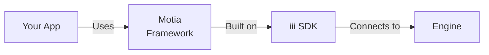

Motia is a high-level polyglot framework built on top of the iii SDK that provides type safety, declarative configuration, and structured workflows. Steps can be written in JavaScript, TypeScript, or Python.

## Why Motia?

While the base `iii` SDK gives you full control, Motia adds:

- **Polyglot Support**: Write steps in JavaScript, TypeScript, or Python
- **Type Safety**: Validation and type checking for all configurations
- **Declarative Steps**: Define workflows as step files
- **Auto-Discovery**: CLI automatically finds and loads steps
- **Flow Context**: Built-in state, logging, and event emission
- **Middleware Support**: Request/response interceptors for API routes



## Installation

### JavaScript/TypeScript

```bash
npm install @iii-dev/motia
# or
yarn add @iii-dev/motia
```

### Python

```bash
uv pip install iii-motia
# or
pip install iii-motia
```

## Quick Start

### 1. Create a Step File

Steps are the building blocks of Motia, and can be written in JavaScript, TypeScript, or Python.

### TypeScript

**TypeScript Example** (`steps/hello.step.ts`):

```typescript
import type { StepConfig, Handlers } from '@iii-dev/motia'
import { z } from 'zod'

export const config: StepConfig = {
  name: 'hello',
  triggers: [
    {
      type: 'api',
      path: '/hello/:name',
      method: 'GET',
      responseSchema: {
        200: z.object({
          message: z.string(),
        }),
      },
    },
  ],
}

export const handler: Handlers<typeof config> = async (req, { logger }) => {
  const name = req.pathParams.name || 'World'

  logger.info(`Greeting ${name}`)

  return {
    status: 200,
    body: { message: `Hello, ${name}!` },
  }
}
```

### Python

**Python Example** (`steps/hello.step.py`):

```python
from motia import ApiRequest, ApiResponse, FlowContext, api

config = {
    "name": "hello",
    "description": "Return a greeting",
    "triggers": [api("GET", "/hello/:name")],
    "emits": [],
}

async def handler(req: ApiRequest, ctx: FlowContext) -> ApiResponse:
    name = req.path_params.get("name", "World")

    ctx.logger.info(f"Greeting {name}")

    return ApiResponse(status=200, body={"message": f"Hello, {name}!"})
```

### 2. Run Your Application

```bash
# Start iii engine (in another terminal)
iii

# Run Motia (defaults to ./steps)
motia run

# Optional: specify directory
motia run --dir steps
```

### 3. Test Your Endpoint

```bash
curl http://localhost:3111/hello/Alice
# {"message": "Hello, Alice!"}
```

## Step Types

### API Steps

Handle HTTP requests with validation and type safety.

### TypeScript

```typescript
import type { StepConfig, Handlers } from '@iii-dev/motia'
import { z } from 'zod'

export const config: StepConfig = {
  name: 'create-user',
  triggers: [
    {
      type: 'api',
      path: '/users',
      method: 'POST',
      bodySchema: z.object({
        name: z.string(),
        email: z.string().email(),
      }),
      responseSchema: {
        201: z.object({
          id: z.string(),
          name: z.string(),
          email: z.string(),
        }),
      },
    },
  ],
  emits: ['user.created'],
}

export const handler: Handlers<typeof config> = async (req, { emit, logger }) => {
  const user = await createUser(req.body)

  // Emit event
  await emit({ topic: 'user.created', data: user })

  logger.info('User created', { userId: user.id })

  return { status: 201, body: user }
}
```

### Python

```python
from motia import StepConfig, ApiTrigger, ApiRequest, ApiResponse, FlowContext, step_wrapper

config = StepConfig(
    name="create-user",
    triggers=[
        ApiTrigger(
            path="/users",
            method="POST",
            body_schema={
                "type": "object",
                "properties": {
                    "name": {"type": "string"},
                    "email": {"type": "string", "format": "email"}
                },
                "required": ["name", "email"]
            }
        )
    ],
    emits=["user.created"]
)

async def handler(req: ApiRequest, ctx: FlowContext) -> ApiResponse:
    user = await create_user(req.body)

    # Emit event
    await ctx.emit("user.created", user)

    return ApiResponse(status=201, body=user)

step_wrapper(config, __file__, handler)
```

### Event Steps

React to events from the event bus.

### TypeScript

```typescript
import type { StepConfig, Handlers } from '@iii-dev/motia'
import { z } from 'zod'

export const config: StepConfig = {
  name: 'send-welcome-email',
  triggers: [
    {
      type: 'event',
      subscribes: ['user.created'],
      input: z.object({
        id: z.string(),
        name: z.string(),
        email: z.string(),
      }),
    },
  ],
}

export const handler: Handlers<typeof config> = async (data, { logger }) => {
  logger.info(`Sending welcome email to ${data.email}`)
  await sendEmail(data.email, 'Welcome!')
}
```

### Python

```python
from motia import StepConfig, EventTrigger, FlowContext, step_wrapper

config = StepConfig(
    name="send-welcome-email",
    triggers=[
        EventTrigger(subscribes=["user.created"])
    ]
)

async def handler(data, ctx: FlowContext):
    ctx.logger.info(f"Sending welcome email to {data['email']}")
    await send_email(data['email'], "Welcome!")

step_wrapper(config, __file__, handler)
```

### Cron Steps

Run tasks on a schedule using cron expressions.

### TypeScript

```typescript
import type { StepConfig, Handlers } from '@iii-dev/motia'

export const config: StepConfig = {
  name: 'daily-report',
  triggers: [
    {
      type: 'cron',
      cron: '0 9 * * *', // Every day at 9 AM
    },
  ],
  emits: ['report.generated'],
}

export const handler: Handlers<typeof config> = async (data, { emit, logger }) => {
  const report = await generateDailyReport()
  await emit({ topic: 'report.generated', data: report })
  logger.info('Daily report generated')
}
```

### Python

```python
from motia import StepConfig, CronTrigger, FlowContext, step_wrapper

config = StepConfig(
    name="daily-report",
    triggers=[
        CronTrigger(cron="0 9 * * *")  # Every day at 9 AM
    ],
    emits=["report.generated"]
)

async def handler(data, ctx: FlowContext):
    report = await generate_daily_report()
    await ctx.emit("report.generated", report)
    ctx.logger.info("Daily report generated")

step_wrapper(config, __file__, handler)
```

## Multiple Triggers

A single step can respond to multiple trigger types, allowing one handler to process requests from different sources.

### TypeScript

```typescript
import type { StepConfig, Handlers } from '@iii-dev/motia'
import { z } from 'zod'

export const config: StepConfig = {
  name: 'process-order',
  triggers: [
    {
      type: 'api',
      path: '/orders/manual',
      method: 'POST',
    },
    {
      type: 'event',
      subscribes: ['order.created'],
    },
  ],
  emits: ['order.processed'],
}

export const handler: Handlers<typeof config> = async (input, { trigger, logger, emit }) => {
  let orderData

  if (trigger.type === 'api') {
    logger.info('Order received via API')
    orderData = input.body
  } else if (trigger.type === 'event') {
    logger.info('Order received via event')
    orderData = input
  }

  await processOrder(orderData)
  await emit({ topic: 'order.processed', data: orderData })

  if (trigger.type === 'api') {
    return { status: 200, body: { success: true } }
  }
}
```

### Python

```python
from motia import StepConfig, ApiTrigger, EventTrigger, ApiRequest, ApiResponse, FlowContext, step_wrapper

config = StepConfig(
    name="process-order",
    triggers=[
        ApiTrigger(path="/orders/manual", method="POST"),
        EventTrigger(subscribes=["order.created"])
    ],
    emits=["order.processed"]
)

async def handler(input, ctx: FlowContext):
    if ctx.trigger.type == "api":
        ctx.logger.info("Order received via API")
        order_data = input.body
    elif ctx.trigger.type == "event":
        ctx.logger.info("Order received via event")
        order_data = input

    await process_order(order_data)
    await ctx.emit("order.processed", order_data)

    if ctx.trigger.type == "api":
        return ApiResponse(status=200, body={"success": True})

step_wrapper(config, __file__, handler)
```

**Trigger Metadata**: Access `trigger.type`, `trigger.index`, and type-specific fields like `trigger.path`, `trigger.method`, or `trigger.topic` to determine which trigger invoked the handler.

## Trigger Conditions

Conditions allow you to filter trigger executions based on input data. Conditions are evaluated before the handler runs, and if they return `false`, the handler function is not called.

### TypeScript

```typescript
import type { StepConfig, Handlers } from '@iii-dev/motia'
import { z } from 'zod'

const isHighValue = (input: any, { trigger }: any) => {
  const amount = input?.body?.amount || input?.amount || 0
  return amount > 1000
}

export const config: StepConfig = {
  name: 'process-payment',
  triggers: [
    {
      type: 'api',
      path: '/payments',
      method: 'POST',
      condition: isHighValue,
      bodySchema: z.object({
        amount: z.number(),
        currency: z.string(),
      }),
    },
  ],
}

export const handler: Handlers<typeof config> = async (req, { logger }) => {
  logger.info(`Processing high-value payment: ${req.body.amount}`)
  await processPayment(req.body)
  return { status: 200, body: { processed: true } }
}
```

### Python

```python
from motia import StepConfig, EventTrigger, FlowContext, step_wrapper

def is_high_value(input, ctx: FlowContext) -> bool:
    amount = input.get("amount", 0) if isinstance(input, dict) else 0
    return amount > 1000

config = StepConfig(
    name="process-high-value-order",
    triggers=[
        EventTrigger(
            subscribes=["order.created"],
            condition=is_high_value
        )
    ]
)

async def handler(data, ctx: FlowContext):
    ctx.logger.info(f"Processing high-value order: {data['amount']}")
    await process_order(data)

step_wrapper(config, __file__, handler)
```

### Conditions with Multiple Triggers

Each trigger in a multi-trigger step can have its own condition:

```python
from motia import StepConfig, ApiTrigger, EventTrigger, FlowContext, step_wrapper

def is_verified_user(input, ctx: FlowContext) -> bool:
    if ctx.trigger.type == "api":
        return input.headers.get("x-verified") == "true"
    return True

def is_high_value(input, ctx: FlowContext) -> bool:
    amount = input.get("amount", 0) if isinstance(input, dict) else 0
    return amount > 1000

config = StepConfig(
    name="process-order",
    triggers=[
        ApiTrigger(
            path="/orders/manual",
            method="POST",
            condition=is_verified_user
        ),
        EventTrigger(
            subscribes=["order.created"],
            condition=is_high_value
        )
    ],
    emits=["order.processed"]
)

async def handler(input, ctx: FlowContext):
    ctx.logger.info(f"Processing order via {ctx.trigger.type}")
    await process_order(input)
    await ctx.emit("order.processed", input)

step_wrapper(config, __file__, handler)
```

**How Conditions Work**:

- Conditions receive the same input as the handler
- They must return a boolean (`True` to execute, `False` to skip)
- Conditions can be sync or async functions
- If a condition returns `False`, the handler is never invoked

> **Learn More**: For technical details on trigger indexing, TriggerInput normalization, and condition evaluation flow, see [SDK Implementation](/docs/advanced/sdk-implementation#multi-trigger-architecture).

## Flow Context

Every handler receives a `FlowContext` with runtime utilities:

> **Naming Conventions**: TypeScript uses camelCase (`traceId`, `pathParams`) while Python uses snake_case (`trace_id`, `path_params`). The examples below show both styles.

<ResponseField name="emit" type="function">
  Emit events to the event bus.

**TypeScript:**

```typescript
await emit({ topic: 'topic.name', data: { key: 'value' } })
```

**Python:**

```python
await ctx.emit("topic.name", {"key": "value"})
```

</ResponseField>

<ResponseField name="trigger" type="TriggerMetadata">
  Metadata about which trigger invoked the handler. Useful for multi-trigger steps.

**TypeScript:**

```typescript
if (trigger.type === 'api') {
  console.log(`API ${trigger.method} ${trigger.path}`)
} else if (trigger.type === 'event') {
  console.log(`Event ${trigger.topic}`)
}
```

**Python:**

```python
if ctx.trigger.type == "api":
  ctx.logger.info(f"API {ctx.trigger.method} {ctx.trigger.path}")
elif ctx.trigger.type == "event":
  ctx.logger.info(f"Event {ctx.trigger.topic}")
```

**Fields**: `type` (api/event/cron), `index` (trigger position), plus type-specific fields like `path`, `method`, `topic`, or `expression`.

</ResponseField>

<ResponseField name="traceId / trace_id" type="string">
  Distributed tracing identifier for correlating logs.

**TypeScript:**

```typescript
logger.info(`[${traceId}] Processing request`)
```

**Python:**

```python
ctx.logger.info(f"[{ctx.trace_id}] Processing request")
```

</ResponseField>

<ResponseField name="state" type="InternalStateManager">
  Internal state management (uses `$$internal-state` stream).

**TypeScript:**

```typescript
await state.set('config', 'theme', 'dark')
const theme = await state.get('config', 'theme')
```

**Python:**

```python
await ctx.state.set("config", "theme", "dark")
theme = await ctx.state.get("config", "theme")
```

</ResponseField>

<ResponseField name="streams" type="Streams">
  Access to stream instances.

**TypeScript:**

```typescript
await streams.todos.set('inbox', 'item-1', { title: 'Buy milk' })
```

**Python:**

```python
todo_stream = Stream("todos")
await todo_stream.set("inbox", "item-1", {"title": "Buy milk"})
```

</ResponseField>

<ResponseField name="logger" type="Logger">
  Context-aware logger with trace ID.

**TypeScript:**

```typescript
logger.info('Processing started')
logger.error('An error occurred')
```

**Python:**

```python
ctx.logger.info("Processing started")
ctx.logger.error("An error occurred", exc_info=True)
```

</ResponseField>

## Streams and State

### Using Streams

Streams provide distributed state management:

```python
from motia import Stream, ApiRequest, ApiResponse, FlowContext, step_wrapper

# Define stream
todo_stream = Stream("todos")

async def create_todo(req: ApiRequest, ctx: FlowContext) -> ApiResponse:
    todo_id = generate_id()
    todo = {
        "id": todo_id,
        "title": req.body["title"],
        "completed": False
    }

    # Store in stream
    await todo_stream.set("inbox", todo_id, todo)

    return ApiResponse(status=201, body=todo)

async def get_todos(req: ApiRequest, ctx: FlowContext) -> ApiResponse:
    # Get all todos in group
    todos = await todo_stream.get_group("inbox")
    return ApiResponse(status=200, body=todos)
```

**Stream Hierarchy:**

- **Stream Name**: `todos` (top-level namespace)
- **Group ID**: `inbox` (partition within stream)
- **Item ID**: `todo-123` (unique identifier)
- **Data**: The actual JSON payload

### Internal State

Use `ctx.state` for configuration and internal data:

```python
async def handler(req: ApiRequest, ctx: FlowContext) -> ApiResponse:
    # Set state
    await ctx.state.set("user-prefs", "theme", "dark")

    # Get state
    theme = await ctx.state.get("user-prefs", "theme")

    # Get all in group
    prefs = await ctx.state.get_group("user-prefs")

    # Delete
    await ctx.state.delete("user-prefs", "theme")
```

## Middleware

Add middleware for authentication, logging, or validation:

```python
from motia import StepConfig, ApiTrigger, ApiRequest, ApiResponse, FlowContext, step_wrapper

# Define middleware
async def auth_middleware(req: ApiRequest, ctx: FlowContext, next_handler):
    token = req.headers.get("authorization")

    if not token:
        return ApiResponse(status=401, body={"error": "Unauthorized"})

    # Validate token
    user = await validate_token(token)
    if not user:
        return ApiResponse(status=401, body={"error": "Invalid token"})

    # Add user to context (you can modify req or ctx here)
    ctx.user = user

    # Call next handler
    return await next_handler(req, ctx)

# Use middleware in step
config = StepConfig(
    name="protected-route",
    triggers=[
        ApiTrigger(
            path="/protected",
            method="GET",
            middleware=[auth_middleware]  # Add middleware
        )
    ]
)

async def handler(req: ApiRequest, ctx: FlowContext) -> ApiResponse:
    # ctx.user is available here
    return ApiResponse(
        status=200,
        body={"message": f"Hello, {ctx.user['name']}"}
    )

step_wrapper(config, __file__, handler)
```

## Infrastructure Configuration

Define compute resources and queue behavior for your steps:

```python
from motia import StepConfig, EventTrigger, InfrastructureConfig, HandlerConfig, QueueConfig, FlowContext, step_wrapper

config = StepConfig(
    name="heavy-processing",
    triggers=[
        EventTrigger(subscribes=["data.uploaded"])
    ],
    infrastructure=InfrastructureConfig(
        handler=HandlerConfig(
            ram=512,      # 512 MB memory
            cpu=2,        # 2 CPU cores
            timeout=300   # 5 minute timeout
        ),
        queue=QueueConfig(
            type="fifo",                  # FIFO queue (or "standard")
            max_retries=5,                # Retry 5 times on failure
            concurrency=10,               # Process 10 messages concurrently
            backoff_type="exponential",   # "fixed" or "exponential" retry backoff
            backoff_delay_ms=1000,        # Initial backoff delay (1 second)
            visibility_timeout=60,        # 1 minute visibility timeout
            delay_seconds=10              # 10 second initial delay
        )
    )
)

async def handler(data, ctx: FlowContext):
    # Heavy processing logic
    await process_large_file(data)

step_wrapper(config, __file__, handler)
```

**Queue Configuration Notes**:

- Queue configuration applies to **event triggers only** (not API or Cron)
- Settings are **per-subscription**, meaning each event topic can have different queue behavior
- `backoff_type`: Controls retry delay strategy - `"fixed"` for constant delays or `"exponential"` for increasing delays
- `concurrency`: Maximum number of messages processed simultaneously for this subscription
- Queue settings override adapter defaults when specified

## CLI Commands

<AccordionGroup>
  <Accordion title="motia run">
    Run your Motia application:

    ```bash
    # Run with default directory (./steps)
    motia run

    # Specify directory
    motia run --dir ./my-steps

    # Enable watch mode for hot-reload
    motia run --watch

    # Verbose logging
    motia run --verbose
    ```

  </Accordion>

  <Accordion title="motia build">
    Build your project (prepare for deployment):

    ```bash
    motia build
    ```

  </Accordion>
</AccordionGroup>

## Project Structure

Organize your Motia project. Steps can use `.ts`, `.js`, or `.py` extensions:

**TypeScript/JavaScript Project:**

```
my-app/
├── steps/
│   ├── api/
│   │   ├── users.step.ts
│   │   └── orders.step.ts
│   ├── events/
│   │   ├── notifications.step.ts
│   │   └── analytics.step.ts
│   └── cron/
│       └── cleanup.step.ts
├── config.yaml          # Engine configuration
├── package.json
└── tsconfig.json
```

**Python Project:**

```
my-app/
├── steps/
│   ├── api/
│   │   ├── users.step.py
│   │   └── orders.step.py
│   ├── events/
│   │   ├── notifications.step.py
│   │   └── analytics.step.py
│   └── cron/
│       └── cleanup.step.py
├── config.yaml          # Engine configuration
├── pyproject.toml
└── uv.lock
```

## Complete Example: Todo API

This example shows a simple Todo API with create, list, and notification functionality.

### TypeScript

**steps/create_todo.step.ts**

```typescript
import type { StepConfig, Handlers } from '@iii-dev/motia'
import { z } from 'zod'

const todoSchema = z.object({
  id: z.string(),
  title: z.string(),
  completed: z.boolean(),
})

export const config: StepConfig = {
  name: 'create-todo',
  triggers: [
    {
      type: 'api',
      path: '/todos',
      method: 'POST',
      bodySchema: z.object({
        title: z.string(),
      }),
      responseSchema: {
        201: todoSchema,
      },
    },
  ],
  emits: ['todo.created'],
}

export const handler: Handlers<typeof config> = async (req, { streams, emit, logger }) => {
  const todoId = `todo-${Date.now()}-${Math.random().toString(36).substring(2, 9)}`

  const todo = {
    id: todoId,
    title: req.body.title,
    completed: false,
  }

  await streams.todos.set('default', todoId, todo)
  await emit({ topic: 'todo.created', data: todo })

  logger.info('Created todo', { todoId })

  return { status: 201, body: todo }
}
```

**steps/list_todos.step.ts**

```typescript
import type { StepConfig, Handlers } from '@iii-dev/motia'
import { z } from 'zod'

export const config: StepConfig = {
  name: 'list-todos',
  triggers: [
    {
      type: 'api',
      path: '/todos',
      method: 'GET',
      responseSchema: {
        200: z.array(
          z.object({
            id: z.string(),
            title: z.string(),
            completed: z.boolean(),
          }),
        ),
      },
    },
  ],
}

export const handler: Handlers<typeof config> = async (req, { streams }) => {
  const todos = await streams.todos.getGroup('default')
  return { status: 200, body: todos }
}
```

**steps/notify_todo.step.ts**

```typescript
import type { StepConfig, Handlers } from '@iii-dev/motia'
import { z } from 'zod'

export const config: StepConfig = {
  name: 'notify-todo-created',
  triggers: [
    {
      type: 'event',
      subscribes: ['todo.created'],
      input: z.object({
        id: z.string(),
        title: z.string(),
        completed: z.boolean(),
      }),
    },
  ],
}

export const handler: Handlers<typeof config> = async (data, { logger }) => {
  logger.info('New todo created', { title: data.title })
  // Send notification logic here
}
```

### Python

**steps/create_todo.step.py**

```python
from motia import StepConfig, ApiTrigger, ApiRequest, ApiResponse, FlowContext, Stream, step_wrapper

todo_stream = Stream("todos")

config = StepConfig(
    name="create-todo",
    triggers=[
        ApiTrigger(path="/todos", method="POST")
    ],
    emits=["todo.created"]
)

async def handler(req: ApiRequest, ctx: FlowContext) -> ApiResponse:
    import uuid

    todo_id = str(uuid.uuid4())
    todo = {
        "id": todo_id,
        "title": req.body["title"],
        "completed": False
    }

    await todo_stream.set("default", todo_id, todo)
    await ctx.emit("todo.created", todo)

    ctx.logger.info(f"Created todo: {todo_id}")

    return ApiResponse(status=201, body=todo)

step_wrapper(config, __file__, handler)
```

**steps/list_todos.step.py**

```python
from motia import StepConfig, ApiTrigger, ApiRequest, ApiResponse, FlowContext, Stream, step_wrapper

todo_stream = Stream("todos")

config = StepConfig(
    name="list-todos",
    triggers=[
        ApiTrigger(path="/todos", method="GET")
    ]
)

async def handler(req: ApiRequest, ctx: FlowContext) -> ApiResponse:
    todos = await todo_stream.get_group("default")
    return ApiResponse(status=200, body=todos)

step_wrapper(config, __file__, handler)
```

**steps/notify_todo.step.py**

```python
from motia import StepConfig, EventTrigger, FlowContext, step_wrapper

config = StepConfig(
    name="notify-todo-created",
    triggers=[
        EventTrigger(subscribes=["todo.created"])
    ]
)

async def handler(data, ctx: FlowContext):
    ctx.logger.info(f"New todo created: {data['title']}")
    # Send notification logic here

step_wrapper(config, __file__, handler)
```

## Best Practices

<AccordionGroup>
  <Accordion title="Organize by Feature">
    Group related steps together:

    ```
    steps/
    ├── users/
    │   ├── create.step.py
    │   ├── update.step.py
    │   └── notify.step.py
    └── orders/
        ├── create.step.py
        └── process.step.py
    ```

  </Accordion>

  <Accordion title="Use Type Hints">
    Leverage Python type hints for better IDE support:

    ```python
    from typing import Dict, Any

    async def handler(
        req: ApiRequest[Dict[str, Any]],
        ctx: FlowContext
    ) -> ApiResponse[Dict[str, Any]]:
        ...
    ```

  </Accordion>

  <Accordion title="Error Handling">
    Always handle errors gracefully:

    ```python
    async def handler(req: ApiRequest, ctx: FlowContext) -> ApiResponse:
        try:
            result = await process_data(req.body)
            return ApiResponse(status=200, body=result)
        except ValueError as e:
            ctx.logger.error(f"Validation error: {e}")
            return ApiResponse(status=400, body={"error": str(e)})
        except Exception as e:
            ctx.logger.error(f"Unexpected error: {e}", exc_info=True)
            return ApiResponse(status=500, body={"error": "Internal error"})
    ```

  </Accordion>

  <Accordion title="Emit Events for Workflows">
    Use events to chain operations:

    ```python
    # Step 1: Create order
    await ctx.emit("order.created", order)

    # Step 2: Process payment (separate step listening to order.created)
    # Step 3: Send confirmation (separate step listening to payment.completed)
    ```

  </Accordion>
</AccordionGroup>

## Next Steps

<Columns cols={2}>
  <Card icon={<Code />} title="Base SDK" href="/docs/tutorials/quickstart">
    Learn about the low-level iii SDK
  </Card>
  <Card icon={<Activity />} title="Streams" href="/docs/modules/module-stream">
    Deep dive into state management
  </Card>
</Columns>
