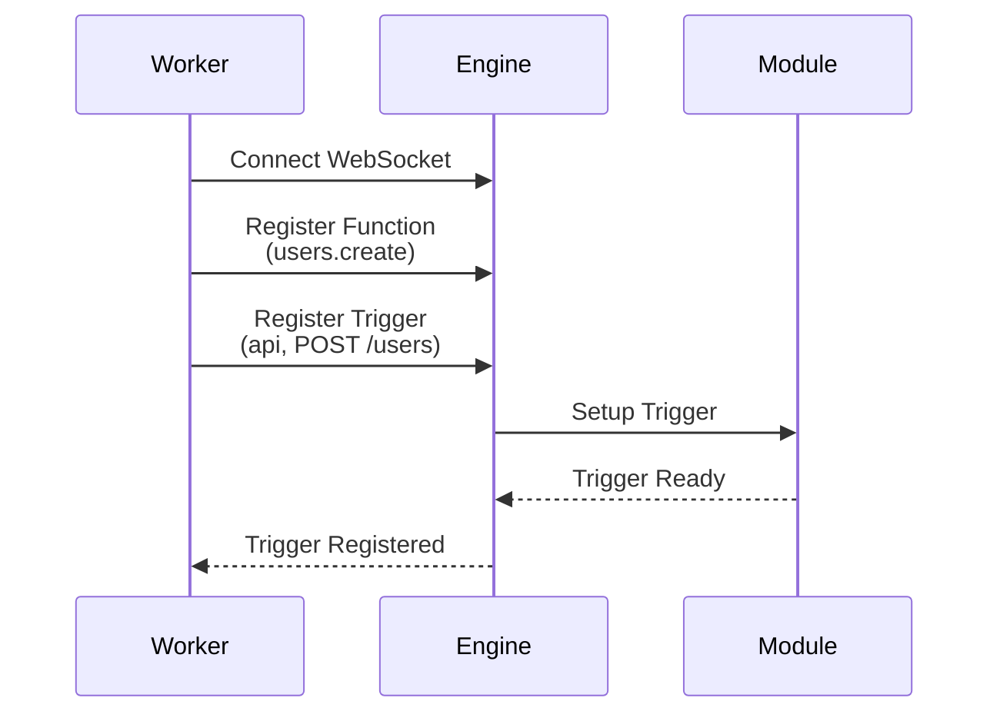
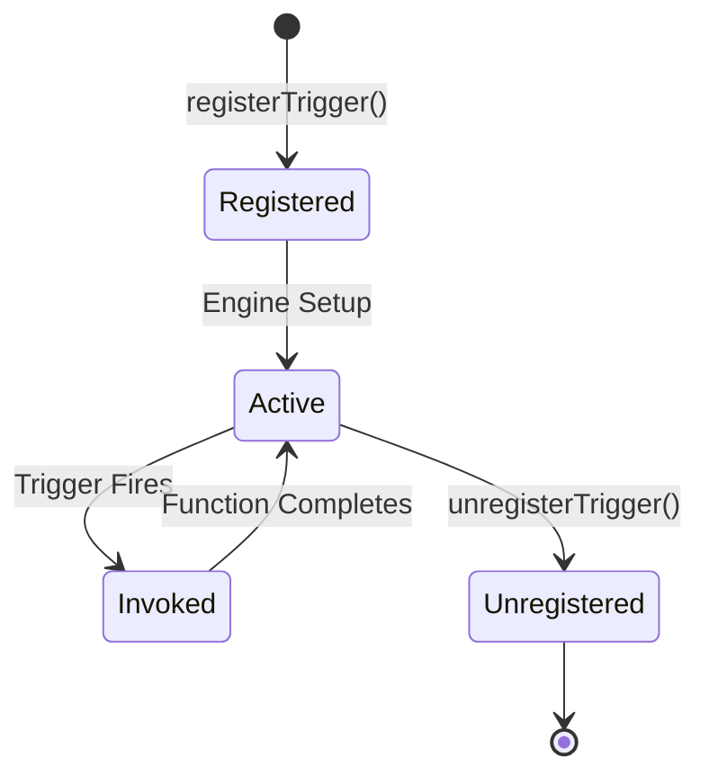

## Trigger Components

A trigger consists of three parts:

1. **Trigger Type**: The mechanism that initiates execution (http, queue, cron, log, stream)
2. **Configuration**: Type-specific settings (path, schedule, topics)
3. **Function ID**: The function to invoke when triggered

```typescript
iii.registerTrigger({
  type: 'http',
  function_id: fn.id,
  config: {
    api_path: '/users',
    http_method: 'POST',
  },
})
```

## Registering Triggers

Triggers are registered by workers after establishing a connection to the engine:



### Registration Flow

**Step 1: Register Function**

First, register the function that will be invoked:

```typescript
const fn = iii.registerFunction({ id: 'users.create' }, async (data) => {
  return { id: '123', ...data }
})
```

**Step 2: Register Trigger**

Then, register a trigger that routes to that function:

```typescript
iii.registerTrigger({
  type: 'http',
  function_id: fn.id,
  config: {
    api_path: '/users',
    http_method: 'POST',
  },
})
```

**Step 3: Trigger Active**

The engine sets up the trigger in the appropriate module. When an HTTP POST request comes to `/users`, the `users.create` function will be invoked.

## Trigger Configurations by Type

### API Trigger Configuration

```typescript
{
  type: 'http',
  function_id: fn.id,
  config: {
    api_path: '/api/v1/resource/:id',
    http_method: 'GET' | 'POST' | 'PUT' | 'DELETE' | 'PATCH'
  }
}
```

**Path Parameters**: Extract values from URL

```typescript
// Trigger: api_path: '/users/:userId/posts/:postId'
// Request: GET /users/123/posts/456
// Handler receives: { path_params: { userId: '123', postId: '456' } }
```

### Event Trigger Configuration

```typescript
{
  type: 'queue',
  function_id: fn.id,
  config: {
    topic: 'user.created'
  }
}
```

**Multiple Topics**: Register separate triggers for each topic.

### Cron Trigger Configuration

```typescript
{
  type: 'cron',
  function_id: fn.id,
  config: {
    cron: '*/5 * * * *'
  }
}
```

**Cron Expression**: Standard 5-field format (minute hour day month weekday)

### Log Trigger Configuration

```typescript
{
  type: 'log',
  function_id: fn.id,
  config: {
    level: 'error'
  }
}
```

**Log Levels**: `info`, `warn`, `error`, `debug` (omit to receive all levels)

### Stream Trigger Configuration

```typescript
{
  type: 'stream:join',
  function_id: fn.id,
  config: {}
}
```

## Multiple Triggers to One Function

A single function can have multiple triggers:

```typescript
const fn = iii.registerFunction({ id: 'users.notify' }, async (data) => {
  await sendNotification(data)
})

iii.registerTrigger({
  type: 'http',
  function_id: fn.id,
  config: { api_path: '/notify', http_method: 'POST' },
})

iii.registerTrigger({
  type: 'queue',
  function_id: fn.id,
  config: { topic: 'user.created' },
})

iii.registerTrigger({
  type: 'cron',
  function_id: fn.id,
  config: { cron: '0 9 * * *' },
})
```

**Use Case**: Send notifications via API calls, events, or scheduled jobs using the same logic.

## Trigger Lifecycle



### Unregistering Triggers

Remove triggers dynamically. `registerTrigger` returns a trigger object with `unregister()`:

```typescript
const fn = iii.registerFunction({ id: 'api.temp' }, async () => ({ status_code: 200, body: {} }))
const trigger = iii.registerTrigger({
  type: 'http',
  function_id: fn.id,
  config: { api_path: '/temp', http_method: 'GET' },
})

trigger.unregister()
```

## Trigger Patterns

### Webhook Handler

```typescript
const fn = iii.registerFunction({ id: 'webhooks.github' }, async (req) => {
  const event = req.headers?.['x-github-event']
  const payload = req.body

  await processGitHubWebhook(event, payload)

  return { status_code: 200, body: { received: true } }
})

iii.registerTrigger({
  type: 'http',
  function_id: fn.id,
  config: {
    api_path: '/webhooks/github',
    http_method: 'POST',
  },
})
```

### Event Chain

```typescript
const processFn = iii.registerFunction({ id: 'orders.process' }, async (order) => {
  await saveOrder(order)
  await iii.call('enqueue', {
    topic: 'order.processed',
    data: order,
  })
})

iii.registerTrigger({
  type: 'queue',
  function_id: processFn.id,
  config: { topic: 'order.placed' },
})

const confirmFn = iii.registerFunction({ id: 'orders.sendConfirmation' }, async (order) => {
  await sendEmail(order.email, 'Order confirmed')
})

iii.registerTrigger({
  type: 'queue',
  function_id: confirmFn.id,
  config: { topic: 'order.processed' },
})
```

### Scheduled Cleanup

```typescript
const fn = iii.registerFunction({ id: 'maintenance.cleanup' }, async () => {
  const deleted = await deleteOldRecords()
  logger.info(`Deleted ${deleted} old records`)
})

iii.registerTrigger({
  type: 'cron',
  function_id: fn.id,
  config: {
    cron: '0 3 * * *',
  },
})
```

## Best Practices

<AccordionGroup>
  <Accordion title="Use Descriptive Trigger IDs">
    Provide unique IDs for easier management:

    ```typescript
    const trigger = iii.registerTrigger({
      type: 'http',
      function_id: fn.id,
      config: { api_path: '/users', http_method: 'POST' }
    })
    ```

  </Accordion>

  <Accordion title="Match Function Capabilities">
    Ensure trigger configuration matches what the function expects:

    ```typescript
    const fn = iii.registerFunction({ id: 'users.create' }, async ({ name, email }) => { /* ... */ })

    iii.registerTrigger({
      type: 'http',
      function_id: fn.id,
      config: { api_path: '/users', http_method: 'POST' }
    })
    ```

  </Accordion>

  <Accordion title="Namespace Your Paths">
    Use consistent path patterns:

    ```typescript
    // Good: Organized, versioned
    api_path: '/api/v1/users'
    api_path: '/api/v1/orders'

    // Avoid: Inconsistent
    api_path: '/getUsers'
    api_path: '/order-list'
    ```

  </Accordion>

  <Accordion title="Handle Trigger Errors">
    Functions should handle errors gracefully:

    ```typescript
    iii.registerFunction({ id: 'api.create' }, async (req) => {
      try {
        const result = await createResource(req.body)
        return { status_code: 201, body: result }
      } catch (error) {
        return {
          status_code: 400,
          body: { error: error.message }
        }
      }
    })
    ```

  </Accordion>
</AccordionGroup>

## Next Steps

<Columns cols={2}>
  <Card icon={<Zap />} title="Trigger Types" href="/docs/trigger-types">
    Learn about available trigger types
  </Card>
  <Card icon={<Parentheses />} title="Remote Functions" href="/docs/remote-functions">
    Understand how to write functions
  </Card>
</Columns>
