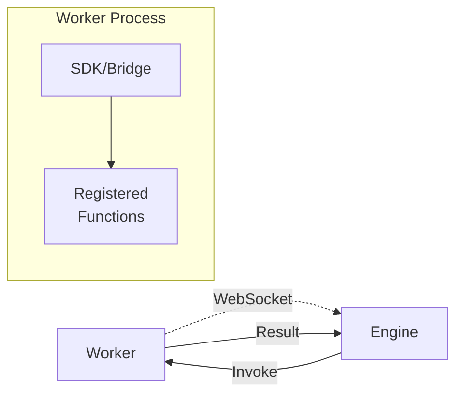
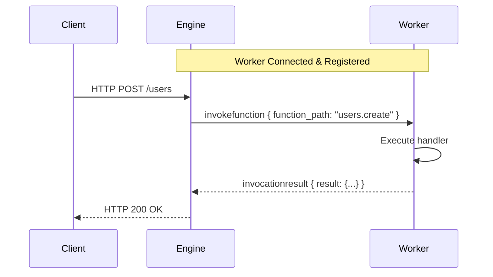
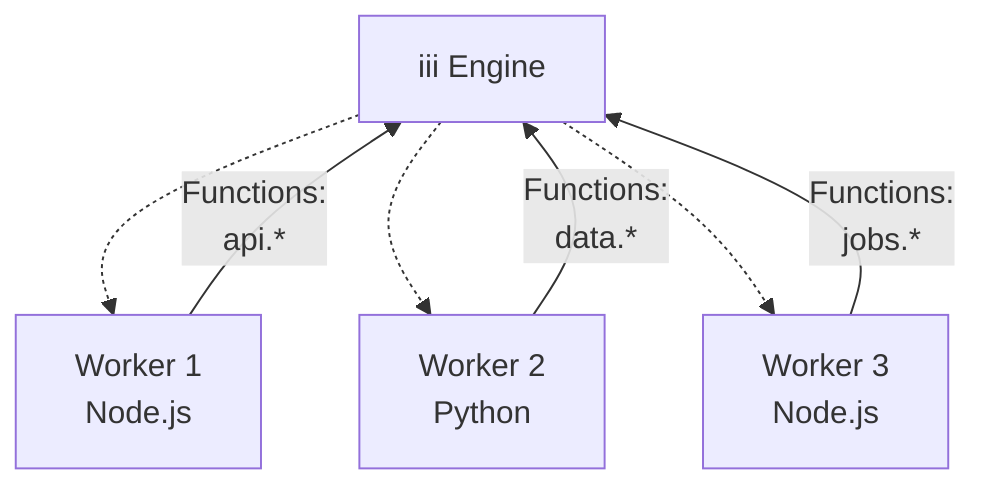

Workers are external processes that connect to the iii Engine via WebSocket to execute business logic.

## What are Workers?

Workers are consumers of the iii architecture that:

- Connect to the Engine via WebSocket (default: `127.0.0.1:49134`)
- Register functions they can execute
- Register triggers that map to those functions
- Receive invocation requests from the Engine
- Return results back to the Engine

Workers can be written in any language with WebSocket support. Official SDKs are available for:

- **Node.js/TypeScript**: `@iii-dev/sdk` (low-level) and `@iii-dev/motia` (high-level framework)
- **Python**: `iii` (low-level) and `motia` (high-level framework)



## Worker Lifecycle

### 1. Connection

Worker establishes WebSocket connection to the Engine:

```typescript
import { createBridge } from '@iii-dev/sdk'

const bridge = createBridge({
  url: 'ws://127.0.0.1:49134',
})

await bridge.connect()
```

### 2. Registration

Worker registers services, functions, and triggers:

```typescript
// Register a service (logical grouping)
bridge.registerService({
  id: 'users',
  name: 'User Management',
})

// Register a function
bridge.registerFunction({
  function_path: 'users.create',
  handler: async (data) => {
    // Business logic here
    return { id: '123', ...data }
  },
})

// Register a trigger
bridge.registerTrigger({
  trigger_type: 'api',
  function_path: 'users.create',
  config: {
    api_path: '/users',
    http_method: 'POST',
  },
})
```

### 3. Execution

Engine invokes functions when triggers fire:



## Worker Registry

The Engine maintains a registry of connected workers:

| Component        | Description                                          |
| ---------------- | ---------------------------------------------------- |
| `WorkerRegistry` | Thread-safe map storing active workers by UUID       |
| `Worker`         | Represents a connected client with WebSocket channel |
| `function_paths` | Set of functions the worker can execute              |
| `invocations`    | Active request IDs being processed                   |

### Worker State

Each worker tracks:

- **UUID**: Unique identifier assigned on connection
- **Function Paths**: List of registered functions (e.g., `users.create`, `api.echo`)
- **Active Invocations**: Currently executing requests
- **WebSocket Channel**: Communication channel to the Engine

## Multiple Workers

You can run multiple workers simultaneously:



**Benefits:**

- **Language Diversity**: Use different languages for different services
- **Service Isolation**: Separate concerns across workers
- **Scalability**: Scale specific workers independently
- **Fault Isolation**: Failure in one worker doesn't affect others

## Example: Complete Worker

### Node.js

```typescript
import { createBridge } from '@iii-dev/sdk'

const bridge = createBridge()

// Register functions
bridge.registerFunction({
  function_path: 'greet.hello',
  handler: async ({ name }) => {
    return { message: `Hello, ${name}!` }
  },
})

// Register API trigger
bridge.registerTrigger({
  trigger_type: 'api',
  function_path: 'greet.hello',
  config: {
    api_path: '/greet/:name',
    http_method: 'GET',
  },
})

// Connect to engine
await bridge.connect()
logger.info('Worker connected!')
```

### Python (iii SDK)

```python
from iii import Bridge

bridge = Bridge()

# Register function
@bridge.function('greet.hello')
async def hello(data):
    name = data.get('name', 'World')
    return {'message': f'Hello, {name}!'}

# Register API trigger
bridge.register_trigger(
    trigger_type='api',
    function_path='greet.hello',
    config={
        'api_path': '/greet/:name',
        'http_method': 'GET'
    }
)

# Connect to engine
bridge.connect()
```

## Best Practices

<AccordionGroup>
  <Accordion title="Function Naming">
    Use dot notation to organize functions: `service.action`

    Examples:
    - `users.create`
    - `users.update`
    - `auth.login`
    - `payments.process`

  </Accordion>

  <Accordion title="Error Handling">
    Always handle errors gracefully and return structured error responses:

    ```typescript
    bridge.registerFunction({
      function_path: 'users.create',
      handler: async (data) => {
        try {
          const user = await createUser(data);
          return { success: true, user };
        } catch (error) {
          return {
            success: false,
            error: {
              code: 'USER_CREATE_FAILED',
              message: error.message,
            },
          };
        }
      },
    });
    ```

  </Accordion>

  <Accordion title="Connection Management">
    Handle disconnections and implement reconnection logic:

    ```typescript
    bridge.on('disconnect', () => {
      console.log('Disconnected from engine');
    });

    bridge.on('connect', () => {
      console.log('Connected to engine');
    });
    ```

  </Accordion>

  <Accordion title="Service Organization">
    Group related functions under services for better organization:

    ```typescript
    // User service
    bridge.registerService({ id: 'users' });
    bridge.registerFunction({ function_path: 'users.create', ... });
    bridge.registerFunction({ function_path: 'users.update', ... });
    bridge.registerFunction({ function_path: 'users.delete', ... });

    // Auth service
    bridge.registerService({ id: 'auth' });
    bridge.registerFunction({ function_path: 'auth.login', ... });
    bridge.registerFunction({ function_path: 'auth.logout', ... });
    ```

  </Accordion>
</AccordionGroup>

## Next Steps

<Columns cols={2}>
  <Card icon={<Code />} title="SDK Quick Start" href="/docs/tutorials/quickstart">
    Learn how to build your first worker with the iii SDK
  </Card>
  <Card icon={<Zap />} title="Trigger Types" href="/docs/trigger-types">
    Understand different ways to trigger functions
  </Card>
</Columns>
