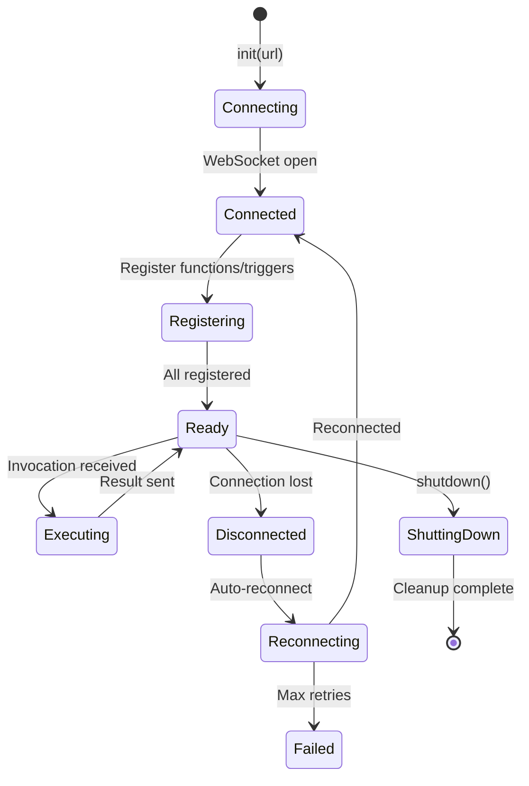
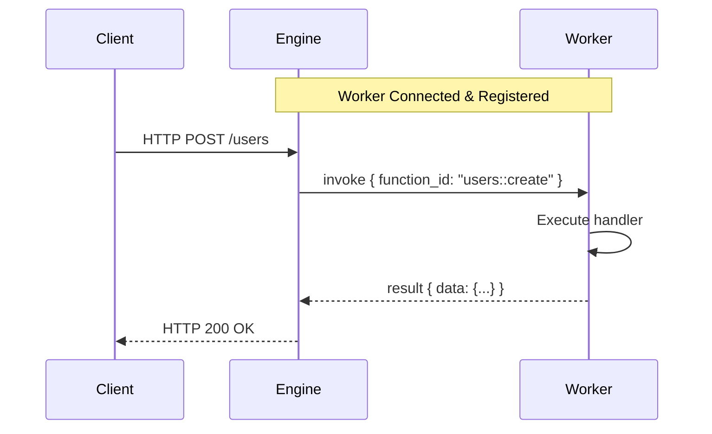
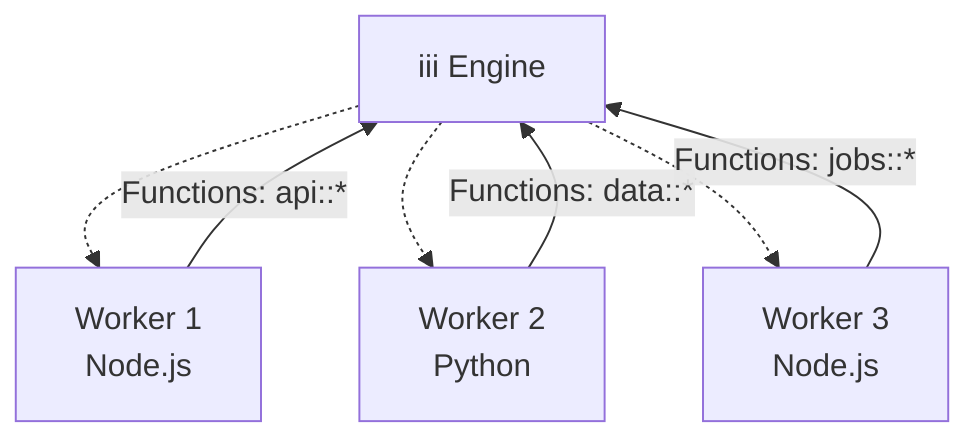

Workers are external processes that connect to the iii Engine via WebSocket to execute business logic.

## What are Workers?

Workers are consumers of the iii architecture that:

- Connect to the Engine via WebSocket (default: `127.0.0.1:49134`)
- Register functions they can execute
- Register triggers that map to those functions
- Receive invocation requests from the Engine
- Return results back to the Engine

Workers can be written in any language with WebSocket support. Official SDKs are available for:

- **Node.js/TypeScript**: `iii-sdk` (low-level) and `iii` (high-level framework)
- **Python**: `iii` (low-level) and `motia` (high-level framework)


## Worker Lifecycle

### Lifecycle Overview



### 1. Connection

Worker establishes WebSocket connection to the Engine:

```typescript
import { init } from 'iii-sdk'

const iii = init('ws://127.0.0.1:49134')
```

### 2. Registration

Worker registers functions and triggers:

```typescript
iii.registerFunction(
  { id: 'users::create' },
  async (data) => {
    return { id: '123', ...data }
  }
)

iii.registerTrigger({
  type: 'http',
  function_id: 'users::create',
  config: {
    api_path: '/users',
    http_method: 'POST',
  },
})
```

### 3. Execution

Engine invokes functions when triggers fire:



## Worker Registry

The Engine maintains a registry of connected workers:

| Component        | Description                                          |
| ---------------- | ---------------------------------------------------- |
| `WorkerRegistry` | Thread-safe map storing active workers by UUID       |
| `Worker`         | Represents a connected client with WebSocket channel |
| `function_ids` | Set of functions the worker can execute              |
| `invocations`    | Active request IDs being processed                   |

### Worker State

Each worker tracks:

- **UUID**: Unique identifier assigned on connection
- **Function IDs**: List of registered functions (e.g., `users::create`, `api::echo`)
- **Active Invocations**: Currently executing requests
- **WebSocket Channel**: Communication channel to the Engine

## Multiple Workers

You can run multiple workers simultaneously:



**Benefits:**

- **Language Diversity**: Use different languages for different services
- **Service Isolation**: Separate concerns across workers
- **Scalability**: Scale specific workers independently
- **Fault Isolation**: Failure in one worker doesn't affect others

## Example: Complete Worker

### Node.js

```typescript
import { init } from 'iii-sdk'

const iii = init('ws://localhost:49134')

iii.registerFunction(
  { id: 'greet::hello' },
  async ({ name }) => {
    return { message: `Hello, ${name}!` }
  }
)

iii.registerTrigger({
  type: 'http',
  function_id: 'greet::hello',
  config: {
    api_path: '/greet/:name',
    http_method: 'GET',
  },
})
```

### Python

```python
import asyncio
from iii import III

async def main():
    iii = III('ws://localhost:49134')

    async def hello(data):
        name = data.get('name', 'World')
        return {'message': f'Hello, {name}!'}

    iii.register_function('greet::hello', hello)

    iii.register_trigger(
        type='http',
        function_id='greet::hello',
        config={
            'api_path': '/greet/:name',
            'http_method': 'GET',
        }
    )

    await iii.connect()

asyncio.run(main())
```

## Best Practices

<AccordionGroup>
  <Accordion title="Function Naming">
    Use double-colon notation to organize functions: `service::action`

    Examples:
    - `users::create`
    - `users::update`
    - `auth::login`
    - `payments::process`

  </Accordion>

  <Accordion title="Error Handling">
    Always handle errors gracefully and return structured error responses:

    ```typescript
    iii.registerFunction(
      { id: 'users::create' },
      async (data) => {
        try {
          const user = await createUser(data);
          return { success: true, user };
        } catch (error) {
          return {
            success: false,
            error: {
              code: 'USER_CREATE_FAILED',
              message: error.message,
            },
          };
        }
      }
    )
    ```

  </Accordion>

  <Accordion title="Connection Management">
    Monitor connection state changes using the SDK:

    ```typescript
    iii.onConnectionStateChange((state) => {
      console.log('Connection state:', state)
    })
    ```

  </Accordion>

  <Accordion title="Function Organization">
    Group related functions by namespace:

    ```typescript
    // User functions
    iii.registerFunction({ id: 'users::create' }, createHandler)
    iii.registerFunction({ id: 'users::update' }, updateHandler)
    iii.registerFunction({ id: 'users::delete' }, deleteHandler)

    // Auth functions
    iii.registerFunction({ id: 'auth::login' }, loginHandler)
    iii.registerFunction({ id: 'auth::logout' }, logoutHandler)
    ```

  </Accordion>
</AccordionGroup>

## Next Steps

<Columns cols={2}>
  <Card icon={<Code />} title="SDK Quick Start" href="/docs/tutorials/quickstart">
    Learn how to build your first worker with the iii SDK
  </Card>
  <Card icon={<Zap />} title="Trigger Types" href="/docs/architecture/trigger-types">
    Understand different ways to trigger functions
  </Card>
</Columns>
