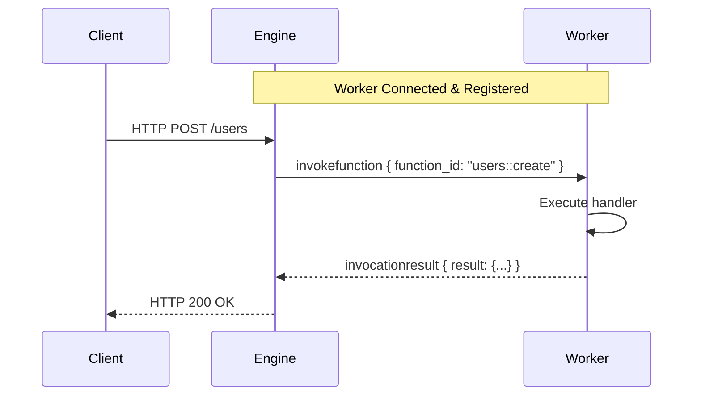
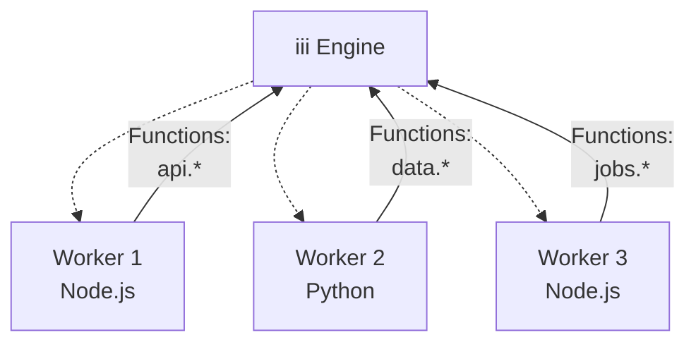

Workers are external processes that connect to the iii Engine via WebSocket to execute business logic.

## What are Workers?

Workers are consumers of the iii architecture that:

- Connect to the Engine via WebSocket (default: `127.0.0.1:49134`)
- Register functions they can execute
- Register triggers that map to those functions
- Receive invocation requests from the Engine
- Return results back to the Engine

Workers can be written in any language with WebSocket support. Official SDKs are available for:

- **Node.js/TypeScript**: `iii-sdk` (low-level) and `iii` (high-level framework)
- **Python**: `iii` (low-level) and `motia` (high-level framework)


## Worker Lifecycle

### 1. Connection

Worker establishes WebSocket connection to the Engine:

```typescript
import { init } from 'iii-sdk'

const iii = await init()
```

### 2. Registration

Worker registers functions and triggers:

```typescript
// Register a function
iii.registerFunction({ id: 'users::create' }, async (data) => {
  // Business logic here
  return { id: '123', ...data }
})

// Register a trigger
iii.registerTrigger({
  type: 'http',
  function_id: 'users::create',
  config: {
    api_path: '/users',
    http_method: 'POST',
  },
})
```

### 3. Execution

Engine invokes functions when triggers fire:



## Worker Registry

The Engine maintains a registry of connected workers:

| Component        | Description                                          |
| ---------------- | ---------------------------------------------------- |
| `WorkerRegistry` | Thread-safe map storing active workers by UUID       |
| `Worker`         | Represents a connected client with WebSocket channel |
| `function_ids` | Set of functions the worker can execute              |
| `invocations`    | Active request IDs being processed                   |

### Worker State

Each worker tracks:

- **UUID**: Unique identifier assigned on connection
- **Function IDs**: List of registered functions (e.g., `users::create`, `api::echo`)
- **Active Invocations**: Currently executing requests
- **WebSocket Channel**: Communication channel to the Engine

## Multiple Workers

You can run multiple workers simultaneously:



**Benefits:**

- **Language Diversity**: Use different languages for different services
- **Service Isolation**: Separate concerns across workers
- **Scalability**: Scale specific workers independently
- **Fault Isolation**: Failure in one worker doesn't affect others

## Example: Complete Worker

### Node.js

```typescript
import { init } from 'iii-sdk'

const iii = await init()

// Register functions
iii.registerFunction({ id: 'greet.hello' }, async ({ name }) => {
  return { message: `Hello, ${name}!` }
})

// Register HTTP trigger
iii.registerTrigger({
  type: 'http',
  function_id: 'greet.hello',
  config: {
    api_path: '/greet/:name',
    http_method: 'GET',
  },
})

logger.info('Worker connected!')
```

### Python (iii SDK)

```python
from iii import III

iii = III()

# Register function
@iii.register_function('greet.hello')
async def hello(data):
    name = data.get('name', 'World')
    return {'message': f'Hello, {name}!'}

# Register HTTP trigger
iii.register_trigger(
    type='http',
    function_id='greet.hello',
    config={
        'api_path': '/greet/:name',
        'http_method': 'GET'
    }
)

# Connect to engine
iii.connect()
```

## Best Practices

<AccordionGroup>
  <Accordion title="Function Naming">
    Use dot notation to organize functions: `service.action`

    Examples:
    - `users.create`
    - `users.update`
    - `auth.login`
    - `payments.process`

  </Accordion>

  <Accordion title="Error Handling">
    Always handle errors gracefully and return structured error responses:

    ```typescript
    iii.registerFunction({ id: 'users::create' }, async (data) => {
      try {
        const user = await createUser(data);
        return { success: true, user };
      } catch (error) {
        return {
          success: false,
          error: {
            code: 'USER_CREATE_FAILED',
            message: error.message,
          },
        };
      }
    });
    ```

  </Accordion>

  <Accordion title="Connection Management">
    Handle disconnections and implement reconnection logic:

    ```typescript
    iii.onConnectionStateChange((state) => {
      console.log('Connection state:', state);
    });
    ```

  </Accordion>

  <Accordion title="Function Organization">
    Group related functions using namespaced IDs:

    ```typescript
    iii.registerFunction({ id: 'users::create' }, createHandler);
    iii.registerFunction({ id: 'users::update' }, updateHandler);
    iii.registerFunction({ id: 'users::delete' }, deleteHandler);

    iii.registerFunction({ id: 'auth::login' }, loginHandler);
    iii.registerFunction({ id: 'auth::logout' }, logoutHandler);
    ```

  </Accordion>
</AccordionGroup>

## Next Steps

<Columns cols={2}>
  <Card icon={<Code />} title="SDK Quick Start" href="/docs/tutorials/quickstart">
    Learn how to build your first worker with the iii SDK
  </Card>
  <Card icon={<Zap />} title="Trigger Types" href="/docs/trigger-types">
    Understand different ways to trigger functions
  </Card>
</Columns>
